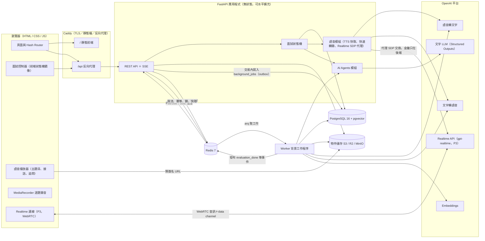
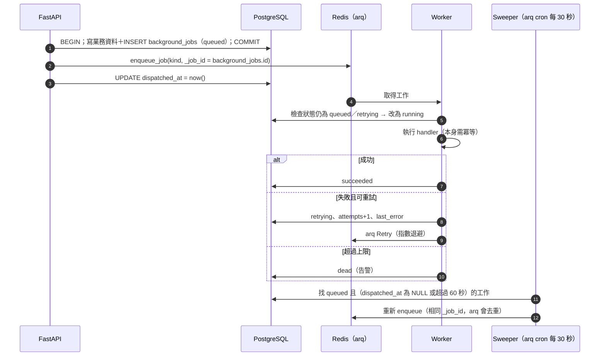
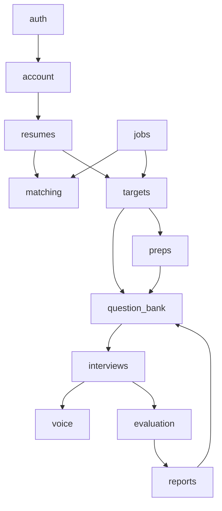
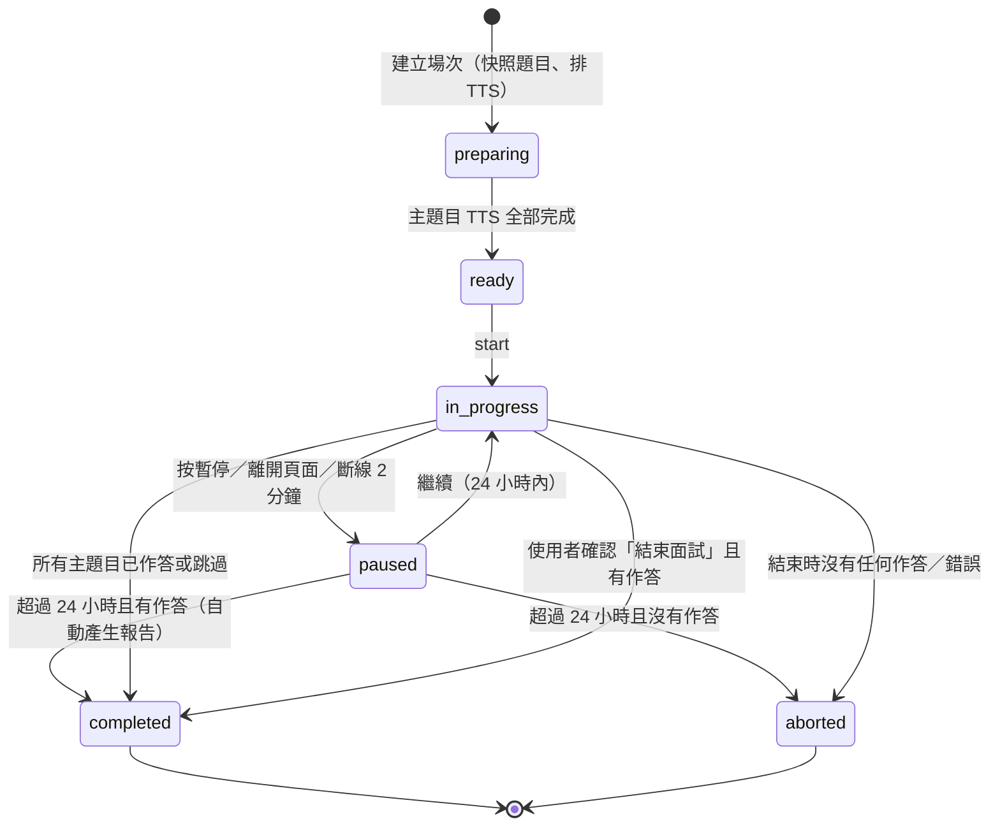
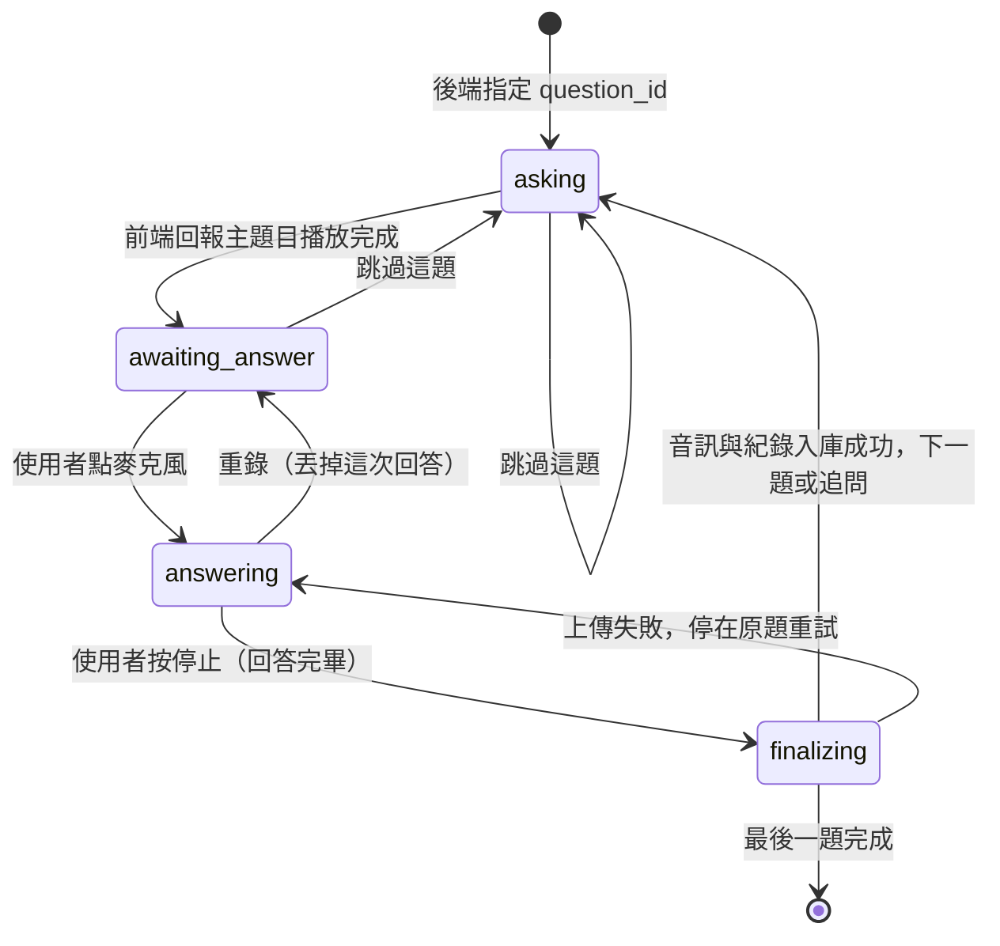
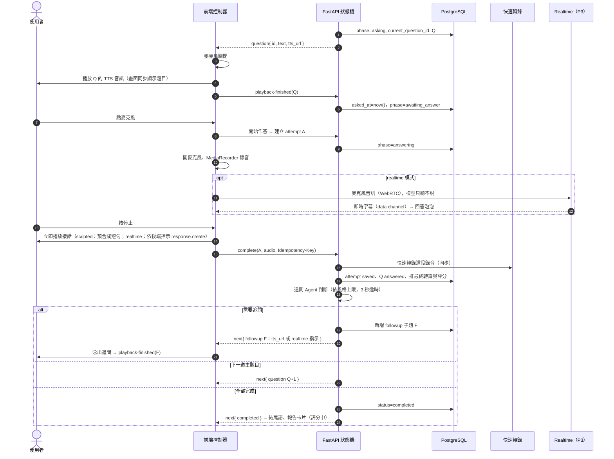

# AI Interview — 系統架構規劃書

> 版本：v0.3（MVP 規劃）・日期：2026-10-10
> 相關文件：[api.md](api.md)（API 規格）・[postgresql.md](postgresql.md)（資料庫與 ER 圖）・[flows.md](flows.md)（各功能流程圖）・[AI Interview.html](AI%20Interview.html)（UI 設計稿）
>
> **v0.3 變更**：即時語音改為「**串接式語音（MVP）＋ Realtime API（擬真升級）**」，不再使用 GPT‑Live。理由見 [§6.1](#61-語音技術選型)。後端不再為每場面試維持 sideband 長連線，也不再需要音訊閘門，API 程序變成無狀態、可水平擴充。

---

## 1. 產品定位與核心原則

**核心賣點**：使用者針對**指定職缺**持續練習；系統讀取**履歷＋職缺**產生面試題目，用**擬真語音面試官**逐題提問，最後針對**每一題**給出評分與口語改善建議。

整套架構建立在一個原則上：

> **系統掌控題目與紀錄，語音只負責呈現。**
>
> 題目順序、目前是第幾題、能不能進下一題、回答有沒有存好，全部由後端狀態機與資料庫決定。主題目由應用程式播放 TTS；語音模型（Realtime，P3）只在後端允許的時機說一句接話或念出追問，**不會自己開口**。

產品驗收條件（貫穿所有設計）：

1. 一場完成的面試，每一道規劃的主題目都有**播放紀錄**。
2. 每一題已作答的題目，都能查回**原題、考生音訊、完整逐字稿、評分與改善建議**。
3. 使用者日後修改履歷或題庫，**舊報告不受影響**（快照）。
4. 新使用者從註冊到開始第一場面試，只需要**貼上一段職缺內容、按一次「開始面試」**（履歷選填）。

---

## 2. 介面與使用體驗

### 2.1 頁面盤點

依 `AI Interview.html`（ChatGPT 風格：左側精簡功能欄、中間單欄內容、黑白配色、深淺色切換）整理：

| 區域 | 路由 | 功能 | 對應後端模組 |
|---|---|---|---|
| 側欄 | — | 搜尋（⌘K）、收合；功能選單依使用順序排列：**新面試 → 題庫生成 → 面試建議 → 職缺搜尋 → 目標職缺 → 面試報告**（目標職缺只從「目標職缺」頁進入，側欄不再重複列出）；有暫停中的面試時最上方顯示「面試暫停中・繼續」；帳號選單（履歷、設定、深淺色、登出） | `targets`、`interviews` |
| 新面試 | `#new` | **面試準備頁**：目標職缺、履歷（選填）、長度、風格、語言、本次題目預覽、「開始面試」。沒有目標職缺時改為引導「貼上職缺內容」；有暫停中的面試時顯示「繼續面試／結束並產生報告」橫幅 | `targets`、`interviews` |
| 目標職缺 | `#targets`、`#targets/{target}` | 列表：每個目標職缺的契合度、題數、最近練習分數；新增目標職缺。詳情：職缺內容（關於、工作內容、條件）、「練習這個職缺／面試題庫／面試建議」三個入口、**準備進度**（題庫題數、建議與清單完成度、最近報告）、移出目標職缺（需確認，資料保留） | `targets` |
| 面試進行中 | `#chat` | 對話式逐字稿（Ava 題目＋使用者回答泡泡）、底部語音列（跳過、重錄、麥克風／停止、進度條）、暫停、結束面試（需確認）、結束後顯示報告卡片（評分中 → 完成） | `interviews`、`voice` |
| 面試報告 | `#report`、`#report/{id}` | 列表：彙總（場數、平均、最高）、搜尋、依時間分組、評分中狀態。詳情：總分與比上次、總評、五個面向、逐題回顧（原題、逐字稿標示重點句、聽我的錄音、做得好、改善建議、可以這樣說）、再練一次、弱項加入題組、刪除報告 | `reports`、`evaluation` |
| 題庫生成 | `#questions`、`#questions/{target}` | 先選目標職缺；進入後是該職缺的**面試題庫**，用輸入框請 Ava 出題（題型、難度、題數選填），題目可編輯、排序、刪除、新增 | `question_bank` |
| 職缺搜尋 | `#jobs` | 職缺庫搜尋與分類、職缺詳情視窗（練習這個職缺／面試題庫／面試建議；已是目標職缺時可查看準備進度或移出）、貼上職缺 | `jobs`、`targets`、`matching` |
| 面試建議 | `#prep`、`#prep/{target}` | 先選目標職缺；進入後最上方是「依據」卡片（職缺內容、使用的履歷、上次分析時間、明顯的「重新分析」按鈕），下面是契合度、優勢、需要補強、高機率方向、可能被問的題目（每題可加入題組）、準備清單；兩個清單旁都有「再多產生」小輸入框（只新增不刪除） | `preps` |
| 設定 | 視窗 | 一般（主題、預設長度／語言／風格、錄音保留）、履歷（上傳、主要履歷、Ava 從履歷讀到的內容）、求職意向（選填）、帳號（名稱、方案用量、刪除紀錄、刪除帳號） | `account`、`resumes` |

**用詞**：介面上每個目標職缺的題目清單稱為「**面試題庫**」；資料表與 API 沿用 `question_sets`（題組）。

UI 原型之外，上線還需要：**登入／註冊頁**、**第一次面試前的麥克風權限說明**、**方案升級頁**。

### 2.2 使用體驗原則

產品的賣點是「針對指定職缺反覆練習」，所以每一個設計決定都以**讓使用者用最少步驟開始練、練完馬上知道怎麼改**為準：

| 原則 | 具體做法 | 影響的規格 |
|---|---|---|
| **一個練習單位：目標職缺** | 使用者只需要管理「我在準備哪些職缺」；題組、面試建議、報告都自動掛在目標職缺下 | `target_jobs`、`/targets` |
| **自動準備，不要求設定** | 貼上職缺 → 自動解析、出第一組題目、產生面試建議；開始面試時題數不足自動補題；履歷選填 | `POST /targets`、`POST /interviews` |
| **記住上次的選擇** | 新面試頁預設上次練習的職缺、履歷、長度、風格、語言；按一次就能開始 | `users.preferences`、`last_practiced_at` |
| **履歷是唯一資料來源** | 不讓使用者填經歷、技能、手機、薪資；設定頁只唯讀顯示「Ava 從履歷讀到的」 | 移除 `user_profiles` 等表 |
| **可以後悔** | 錄音中可重錄；面試可暫停、離開頁面自動暫停、24 小時內繼續；移出目標職缺不刪資料 | `discard`、`pause`／`resume`、`archived` |
| **AI 只新增、不洗掉** | 重新分析、再多產生題目或清單，原本的內容、勾選與編輯都保留，新項目標「新」 | `prep/analyze`、`*/generate` |
| **說清楚 AI 依據什麼** | 面試建議頁上方顯示「依據：職缺內容＋哪份履歷＋上次分析時間」，資料有更新時提示重新分析 | `prep.basis` |
| **同一種操作方式** | 題庫生成、可能題目、準備清單的「請 Ava 多產生」都用同一個小輸入框（需求文字＋幾個選項＋送出） | 前端 composer 元件 |
| **進度永遠看得見** | 出題、分析、評分都顯示「Ava 正在⋯」與骨架；報告完成時通知，不必停在頁面等 | SSE、輪詢、通知 |
| **危險操作先確認** | 結束面試（說明哪些題會評分）、刪除報告、刪除全部紀錄、刪除帳號 | `end`、`DELETE` |
| **錯誤不擋路** | Realtime 連線失敗自動改用串接式語音；上傳失敗保留錄音重試；一次只能一場面試時給「繼續／結束」選擇而不是錯誤 | §6.6、§6.8 |
| **語音模式不讓使用者選** | `scripted` / `realtime` 由後端依方案與可用性決定，使用者只感受到「Ava 在問我」 | `voice_mode` |

### 2.3 已移除的設計與原因

| 原本的設計 | 為什麼拿掉 |
|---|---|
| 首頁 Dashboard（趨勢圖、連續天數、今日小提醒、推薦職缺） | 和「新面試」搶第一眼；練習進度改在面試報告列表看（場數、平均、最高、比上次） |
| 自由文字的「對話式」新面試輸入框 | 需要額外的意圖判斷 LLM、會讓使用者以為能隨時聊天；改成結構化的面試準備頁，貼職缺另開視窗 |
| 收藏職缺 | 和「目標職缺」意思重疊，合併為目標職缺 |
| 一個職缺多個題組 | 使用者要多做一次「選題組」，MVP 改為一個目標職缺一個題組 |
| 個人檔案表單（經歷、技能、手機、薪資、作品集、大頭貼、完整度） | 與履歷重複，增加填寫負擔；題目與評分只需要履歷 |
| 側欄的「最近面試」 | 改到「面試報告」頁統一瀏覽，側欄只留功能與目標職缺 |
| 報告「分享」 | 報告含錄音與個人資料，MVP 不提供公開分享 |
| GPT‑Live＋sideband＋音訊閘門 | 見 §6.1：全雙工對產品沒有幫助，卻需要大量機制壓住模型自行開口；改為串接式＋Realtime（關閉自動輪替） |

---

## 3. 整體架構



### 3.1 部署單元

| 程序 | 啟動方式 | 職責 | MVP 數量 |
|---|---|---|---|
| `web` | Caddy | HTTPS、靜態前端、`/api` 反向代理 | 1 |
| `api` | `uvicorn app.main:app` | REST API、SSE、面試狀態機、快速轉錄、Realtime SDP 代理；**不持有長連線，可直接開多個實例** | 1–N |
| `worker` | `arq app.workers.settings.WorkerSettings` | 履歷解析、題目生成、TTS、轉錄、評分、報告、Embedding、排程工作 | 1–N |
| `postgres` | 託管服務或容器 | 業務資料（唯一真實來源）、工作紀錄（outbox）、Log | 1 |
| `redis` | 託管服務或容器（Redis 7） | 工作佇列 broker、Pub/Sub（SSE）、限流、冪等鍵、分散式鎖、快取 | 1 |
| `object storage` | S3 / Cloudflare R2（開發用 MinIO） | 履歷原檔、主題目與接話 TTS 音訊、逐題回答音訊 | — |

第一版用 **「一個模組化單體（modular monolith）＋一個 worker＋PostgreSQL＋Redis」**，不拆微服務。`api` 與 `worker` 共用同一份程式碼與資料模型。

---

## 4. 技術選型

### 4.1 總表

| 層 | 選擇 | 理由 | 替代方案（何時改） |
|---|---|---|---|
| 前端 | **原生 HTML / CSS / JavaScript（ES Modules）**，無建置步驟 | 沿用原型的 hash router 與元件寫法；面試頁需要直接操作 WebRTC、WebAudio、MediaRecorder，原生 API 最直接 | 頁面變多、需要型別檢查時加 Vite＋TypeScript（不換框架） |
| 前端樣式 | 沿用原型 CSS Variables（黑白、深淺色） | 設計稿已完成 token | — |
| 後端框架 | **FastAPI**＋Pydantic v2 | 非同步、SSE、OpenAPI 自動文件 | — |
| ORM／遷移 | **SQLAlchemy 2.0（async）＋asyncpg＋Alembic** | 成熟、支援 PostgreSQL 特性（JSONB、陣列、部分索引） | — |
| 主資料庫 | **PostgreSQL 16** | 交易一致性（狀態推進）、JSONB 存 AI 結構化輸出、陣列、部分索引、分區表 | — |
| 向量 | **pgvector**（PostgreSQL 擴充） | 職缺契合度排序用 embedding；不必另開向量資料庫 | 職缺量 > 百萬筆再評估 |
| 全文搜尋 | `pg_trgm` 三元組索引 | 中文斷詞在 PG 內建全文搜尋效果差，trigram 對中英混合關鍵字足夠 | 搜尋需求變重時改 Meilisearch / OpenSearch |
| 快取／訊息 | **Redis 7** | 佇列 broker、Pub/Sub、限流、冪等、鎖、快取，一個元件涵蓋多種需求；詳見 §4.3 | — |
| 背景工作佇列 | **arq（asyncio，Redis broker）＋PostgreSQL `background_jobs` 作 outbox** | arq 原生 async，和 FastAPI／asyncpg 共用同一套非同步程式碼；內建重試、逾時、cron。Outbox 確保「資料寫了，工作一定會排」 | 需要多語言 worker 或複雜工作流程時改 Celery / Temporal |
| 物件儲存 | **S3 相容**（正式：AWS S3 或 Cloudflare R2；開發：MinIO） | 音訊與履歷不進資料庫；預簽名 URL 讓前端直接下載 | — |
| 語音（MVP） | **串接式：TTS 播題＋逐題錄音＋STT＋文字 LLM** | 每一步都由程式控制、可保存、可替換；最便宜；題目一字不差 | — |
| 語音（擬真升級，P3） | **OpenAI Realtime API（`gpt-realtime-2.1`），`turn_detection: null`** | 只在後端允許時開口（手動 `response.create`），接話與追問更自然；不需要音訊閘門 | 未來要「可打斷、自由對談」的進階模式時，再評估 GPT‑Live（見 §6.1） |
| 文字 LLM | OpenAI Responses API＋**Structured Outputs（JSON Schema）** | 題目、評分輸出必須可驗證後才入庫 | 抽象成 `LLMClient`，未來可換供應商 |
| STT | OpenAI 語音轉文字：**快速轉錄**（作答送出時同步，供追問判斷與即時顯示）＋**最終轉錄**（worker，評分依據） | 以逐題完整錄音轉錄，不拼接即時字幕 | — |
| TTS | OpenAI TTS；主題目在建立場次時預先合成，接話短句（「嗯，了解」等）依語言與風格預先合成並快取 | 主題目措辭固定、可確認播放完成；接話零延遲 | — |
| 履歷解析 | `pypdf` / `pdfplumber`、`python-docx`；掃描檔再丟 LLM 視覺讀取 | 先抽文字，再用 LLM 結構化 | — |
| 認證 | Email＋密碼（argon2）、Google OAuth；Access JWT（15 分）＋Refresh Token（httpOnly Cookie，DB 存雜湊、輪替） | 前後端同網域，Cookie 最省事又安全 | — |
| Log／觀測 | 結構化 stdout（`structlog`）＋**PostgreSQL 分區表**（AI 呼叫、語音事件、產品事件）＋Sentry | 見 §8 | — |
| 部署 | Docker Compose（開發與 MVP）；正式環境用一般容器平台＋託管 PostgreSQL＋託管 Redis | API 無狀態，只有 SSE 需要長一點的 HTTP 逾時 | — |

### 4.2 為什麼 Log 用 PostgreSQL，而不是 MongoDB

| 考量 | PostgreSQL（建議） | MongoDB |
|---|---|---|
| 維運元件數 | 0 個新增 | 多一套叢集、備份、監控 |
| 與業務資料關聯 | 可直接 `JOIN interview_sessions`、算每位使用者成本 | 需在應用層組合 |
| 半結構化 payload | `JSONB`＋GIN 索引足夠 | 原生強項 |
| 大量寫入與清理 | **按月分區**，過期直接 `DROP PARTITION`，不留碎片 | TTL index |
| 何時該換 | — | 單日事件量到千萬筆以上、或需要彈性分片時 |

結論：**持久保存的 Log 用 PostgreSQL**。改用串接式／Realtime 後，語音事件量大幅下降（不再逐筆記錄 sideband 字幕片段），直接寫入 PostgreSQL 即可。系統運行 log（stdout）另外送到 log 平台（如 Grafana Loki、CloudWatch），不進資料庫。

### 4.3 Redis 使用規劃

**定位：Redis 存「短命、高頻、跨程序協調」的資料；PostgreSQL 是唯一的真實來源。** Redis 資料全部遺失時，系統要能自動恢復，不能遺失面試題目、作答紀錄或評分。

#### 4.3.1 用途

| 用途 | 說明 | 為什麼不用 PostgreSQL |
|---|---|---|
| **工作佇列 broker** | arq 佇列；分 `interactive`（面試中的 TTS、最終轉錄）與 `default`（解析、生成、評分、報告）兩條，各自有 worker，避免批次工作塞住面試 | 低延遲取工作、不用輪詢資料庫 |
| **Pub/Sub** | worker 完成評分 → 推給持有 SSE 連線的 API 實例 | 跨程序即時通知 |
| **限流** | 登入失敗鎖定、題目生成、建立面試、AI 端點 | 計數器高頻寫入、自動過期 |
| **冪等鍵** | 所有帶 `Idempotency-Key` 的 POST，24 小時內回傳同一結果 | 自動過期；處理中狀態防止並發重送 |
| **分散式鎖** | 同一題組同時只有一個生成工作、同一場報告只建一次 | `SET NX PX` 自動過期，不怕程序當掉留下死鎖 |
| **快取** | 職缺搜尋結果、TTS 音訊位置對照（含接話短句） | 減少重複查詢與重複合成 |

**不放進 Redis 的**：面試狀態與題目進度（只在 PostgreSQL，靠 `state_version` 控制）、作答紀錄、評分、refresh token、任何沒有 TTL 又無法重建的資料。

#### 4.3.2 Key 設計

所有 key 以 `ai:` 為前綴（同一個 Redis 給多環境用時改成 `ai:{env}:`）。

| 用途 | Key | 型別 | TTL |
|---|---|---|---|
| 工作佇列 | `arq:queue:interactive`、`arq:queue:default`（arq 管理） | ZSET 等 | arq 管理 |
| 冪等 | `ai:idem:{user_id}:{idempotency_key}` | HASH `{state: processing\|done, status_code, body}` | 24 h |
| 限流 | `ai:rl:{action}:{user_id}:{window_start}` | STRING（INCR） | 視窗長度 |
| 登入失敗 | `ai:rl:login_fail:{sha256(email)}` | STRING（INCR） | 15 min |
| 鎖：題目生成 | `ai:lock:qgen:{set_id}` | STRING（擁有者 token） | 120 s |
| 鎖：報告 | `ai:lock:report:{session_id}` | STRING | 60 s |
| 報告進度推播 | `ai:evt:report:{session_id}` | Pub/Sub channel | — |
| 快取：職缺搜尋 | `ai:cache:jobs:{resume_id}:{sha1(query)}` | STRING（JSON） | 120 s |
| 快取：TTS | `ai:cache:tts:{sha1(text, voice, lang)}` | STRING（物件 key） | 30 天 |

#### 4.3.3 工作投遞：Outbox 模式

只用 Redis 佇列會有一個漏洞：資料庫交易成功、但投遞 Redis 前程序當掉，工作就消失了。所以保留 `background_jobs` 表當 **outbox**：



- `_job_id` 用資料庫 ID，重複投遞不會重複執行。
- Redis 整個清空時，sweeper 會把所有未完成工作從 PostgreSQL 重新投遞。

#### 4.3.4 設定與故障時的行為

- 版本 Redis 7；`appendonly yes`、`appendfsync everysec`；`maxmemory-policy noeviction`（佇列資料不可被淘汰，所以**所有快取 key 一定要設 TTL**）。
- 正式環境用託管服務（AWS ElastiCache、GCP Memorystore 等），開啟 TLS 與密碼；與 API／worker 同區域。
- Python 用 `redis-py`（`redis.asyncio`）與 `arq`。

| Redis 故障時 | 行為 |
|---|---|
| 工作佇列 | 工作仍寫在 `background_jobs`；面試**可以繼續進行**（狀態在 PG），報告延後；Redis 恢復後 sweeper 補投遞 |
| 冪等 | 面試回答上傳退回使用 `answer_attempts.idempotency_key` 唯一約束，關鍵路徑不受影響；其他端點暫時不保證冪等 |
| 限流 | Fail-open，改用程序內記憶體 token bucket；登入失敗鎖定暫時改為較嚴格的單機計數 |
| Pub/Sub | SSE 失效，前端自動改為輪詢報告 |
| TTS 快取 | 直接查物件儲存是否已有同內容音訊，沒有才重新合成 |

---

## 5. 後端模組設計

### 5.1 目錄結構

```
backend/
├── app/
│   ├── main.py                 # FastAPI app、router 掛載
│   ├── core/
│   │   ├── config.py           # pydantic-settings，所有模型名稱、金鑰、上限皆由環境變數設定
│   │   ├── db.py               # async engine / session
│   │   ├── security.py         # 密碼雜湊、JWT、Cookie
│   │   ├── errors.py           # 統一錯誤格式
│   │   ├── storage.py          # S3 客戶端、預簽名 URL
│   │   ├── redis.py            # redis.asyncio 連線池、key 命名、鎖、限流、冪等 middleware
│   │   └── logging.py          # structlog、request_id
│   ├── modules/
│   │   ├── auth/               # 註冊、登入、OAuth、refresh
│   │   ├── account/            # /me：名稱、偏好、用量、上手狀態、刪除帳號
│   │   ├── resumes/            # 上傳、解析、主要履歷
│   │   ├── targets/            # 目標職缺：加入（貼上 JD／職缺庫）、預設履歷、移出 ← 練習單位
│   │   ├── jobs/               # 職缺庫搜尋、職缺解析
│   │   ├── matching/           # 契合度（embedding 粗排）
│   │   ├── preps/              # 面試建議（加入目標職缺時自動產生）
│   │   ├── question_bank/      # 題組（一個目標職缺一組）、題目生成、排序
│   │   ├── interviews/         # 面試場次、狀態機、暫停／繼續、重錄、作答紀錄 ← 核心
│   │   ├── voice/              # VoiceProvider：TTS 與接話短句快取、快速轉錄、Realtime SDP 代理與指示
│   │   ├── evaluation/         # 最終轉錄＋逐題評分
│   │   └── reports/            # 報告列表與詳情、SSE 進度
│   │   # 每個模組：router.py / schemas.py / models.py / service.py / repository.py
│   ├── ai/
│   │   ├── client.py           # LLMClient：重試、逾時、寫入 llm_calls
│   │   ├── prompts/            # 版本化提示詞（*.md，含 prompt_version）
│   │   ├── schemas/            # 每個 agent 的 JSON Schema
│   │   └── agents/             # 見 §7
│   └── workers/
│       ├── queue.py            # enqueue：寫 outbox＋投遞 arq；狀態更新
│       ├── settings.py         # arq WorkerSettings（interactive / default 兩組）
│       ├── cron.py             # sweeper、暫停逾時、音訊清理、分區維護
│       └── handlers/           # 每種 job kind 一個 handler
├── alembic/
└── tests/

frontend/
├── index.html
├── css/                         # 沿用設計稿 token
└── js/
    ├── main.js / router.js / state.js
    ├── api.js                   # fetch 包裝：自動 refresh、錯誤格式、Idempotency-Key
    ├── pages/                   # new（面試準備）/ chat（面試進行中）/ report / questions / jobs / prep / login
    ├── components/              # sidebar / menu（彈出選單）/ modal / settings / search / toast
    └── interview/
        ├── controller.js        # 前端狀態機（只鏡像後端狀態，不自行推進）
        ├── player.js            # 播放主題目、接話短句、追問（TTS 音訊）
        ├── recorder.js          # 逐題 MediaRecorder（麥克風 track）
        └── realtime.js          # P3：WebRTC 連線、data channel、依後端指示送 response.create
```

### 5.2 模組責任與相依



規則：模組之間只透過 `service.py` 互相呼叫，不直接讀別人的 repository；`interviews` 是唯一可以改變面試狀態的模組；`voice` 不知道題目順序，只負責「把指定內容變成聲音、把錄音變成文字」。

---

## 6. 核心設計：系統掌控題目的語音面試

### 6.1 語音技術選型

產品的面試流程是**結構化**的：題目依序問、使用者按麥克風開始、按停止結束、每題存檔評分。依這個需求比較三種做法：

| 需求 | 串接式（TTS＋STT＋LLM） | Realtime API（`turn_detection: null`） | GPT‑Live |
|---|---|---|---|
| 主題目一字不差 | ✅ TTS 照原文念 | 主題目仍用 TTS 最穩 | 官方建議主題目改由 App 播放錄音，並控制模型播放 |
| 由系統決定誰說話、何時換題 | ✅ 完全由程式控制 | ✅ 關閉自動輪替；App 送 `input_audio_buffer.commit`、`response.create` 才開口 | ❌ 全雙工，官方文件未提供關閉自動回應的方式 |
| 判斷「這題答完了」 | ✅ 使用者按停止 | ✅ 同左 | ❌ 字幕沒有回合結束事件，要自己判斷 |
| 接話、追問的自然度 | △ 接話用預錄短句（零延遲），追問等 TTS 約 1 秒 | ✅ 自然 | ✅ 最自然 |
| 額外機制 | 無 | 無（模型不會自己開口） | 音訊閘門、sideband、越界偵測 |
| 計價 | 最低（TTS＋STT＋LLM token） | 依 token 計費 | 依秒計費，背後模型另計 |

**決定**：

- **MVP 用串接式**（`voice_mode = scripted`）。核心賣點（依職缺出題、逐題改善建議）不需要全雙工，串接式最可控、最便宜，也最容易測試。
- **P3 擬真升級用 Realtime API**（`voice_mode = realtime`），只把「接話」與「追問」交給 Realtime 的語音；主題目仍由 TTS 播放。
- **GPT‑Live 暫不採用**。等到要做「可以隨時打斷、自由對談」的進階模式時再評估；屆時新增一個 `VoiceProvider` 實作即可，狀態機與 API 不變。

> 計價與模型名稱以 OpenAI 官方文件與定價頁為準，上線前重新確認（見 §11）。

### 6.2 責任切分

| 誰 | 負責 | 不負責 |
|---|---|---|
| **後端狀態機** | 目前題目、階段推進、追問次數上限與內容、作答紀錄、結束條件；決定這一刻 Ava 能說什麼 | 產生語音 |
| **主題目 TTS 音訊** | 一字不差念出資料庫裡的題目，前端可確認「播放完成」 | 互動 |
| **接話短句（TTS 預合成）** | 回答後的「嗯，了解」「謝謝你的分享」、靜音提醒「這題還有要補充的嗎？」、結尾語 | 內容判斷 |
| **Realtime 語音（P3）** | 在後端指示下說一句自然的接話、念出追問；聽到考生回答以便語氣連貫 | 決定下一題、宣布結束、自己開口 |
| **前端控制器** | 播放語音、開關麥克風、逐題錄音並上傳、依後端回應轉送 Realtime 指示 | 自行推進題號 |
| **Worker** | 最終轉錄、逐題評分、報告 | 即時互動 |

### 6.3 面試場次與題目階段

場次有兩層狀態：`status`（整場生命週期）與 `phase`（目前題目的階段）。





**每次狀態推進**都是一筆資料庫交易，並帶 `expected_version` 做樂觀鎖（詳見 [postgresql.md §6](postgresql.md)）。前端重送、斷線重連都不會跳題。

### 6.4 一題的完整時序



### 6.5 回答與追問的細節

**回答結束**

- **主要方式**：使用者按停止（介面是「點一下開始、再點一下結束」）。
- **靜音提醒**：靜音超過 `ANSWER_SILENCE_PROMPT_SEC`（預設 12 秒），播放「這題還有要補充的嗎？」（scripted 用預合成短句；realtime 用一次受限的 `response.create`）；**不自動切題**。
- **上限**：單題作答超過 `ANSWER_MAX_SEC`（預設 300 秒）前端自動結束並上傳。
- **重錄**：錄音中按「重錄」，丟掉這次錄音（attempt 標記 `discarded`），回到「輪到你了」；不限次數，只有最後送出的那次會評分。
- **硬性規則**：音訊上傳成功且 `answer_attempts` 寫入成功，才能進下一題；失敗則停在原題重試，錄音不丟。

**接話（回答後 Ava 的一句話）**

- scripted：每種語言 × 風格預先合成 6–10 句短句（「嗯，了解。」「謝謝你的分享。」「這個例子很具體。」），前端在使用者按停止的**同時**隨機播放一句，遮住上傳與追問判斷的等待時間。最後一題前換成「好的，我們來聊最後一題。」。
- realtime：後端在 `answers` 回應中先給好接話指示（例如「用 10 字以內自然回應，不評論對錯」），前端在按停止時先送 `input_audio_buffer.commit` 再送 `response.create`。

**追問規則**

| 面試官風格 | 每道主題目追問上限 | 觸發條件 |
|---|---|---|
| 溫和引導 `warm` | 0–1 | 回答過短（< 40 字）或明顯離題 |
| 真實模擬 `real` | 1 | 缺少評分規準中的關鍵要點 |
| 壓力面試 `tough` | 2 | 缺少細節、數據、取捨理由 |

追問 Agent 在 `complete` 請求中**同步**執行，輸入是快速轉錄的文字；逾時 3 秒即視為「不追問」。追問內容由後端產生並存成 `session_questions`（`kind = followup`）。

- scripted：後端即時 TTS 合成追問（約 1 秒），回傳 `tts_url`。
- realtime：後端回傳追問原文與指示，前端送 `response.create`（指示「念出以下追問，可微調語氣，不得改變意思」）；模型實際說出的內容從輸出字幕取得，前端在 `playback-finished` 帶回 `spoken_text`。

### 6.6 語音模式（`voice_mode`）

| 模式 | 說明 | 用途 |
|---|---|---|
| `scripted` | TTS 主題目＋預合成接話＋逐題錄音＋快速轉錄＋TTS 追問；不連即時語音模型 | **MVP 預設**；免費方案；Realtime 失敗時的降級 |
| `realtime` | 同上，但接話與追問改由 Realtime API 的語音說出，回答時有即時字幕 | P3；付費方案 |

兩種模式共用**同一套狀態機、同一套 API、同一套評分管線**，差別只在 `next` 回應給的是 `tts_url` 還是 Realtime 指示，以及前端是否建立 WebRTC。

**Realtime 的控制方式**（模型不會自己開口，因此不需要音訊閘門）：

| 設定／事件 | 用途 |
|---|---|
| `turn_detection: null` | 關閉自動輪替，模型只在收到 `response.create` 時說話 |
| `input_audio_transcription` | 回答時的即時字幕（只用於顯示；評分用最終轉錄） |
| `input_audio_buffer.commit` | 使用者按停止時，把這段回答交給模型當上下文 |
| `response.create`（附單次指示） | 接話、追問、靜音提醒、結尾語；指示由後端產生 |
| 麥克風 `track.enabled` | 播放主題目時關閉，避免模型與錄音收到 TTS 回音 |
| `voice` | 選一個 TTS 與 Realtime 都有的聲音，讓 Ava 的聲音前後一致 |

系統指示（session 建立時由後端設定）：

```text
你是 {company} 的面試官 Ava，風格：{persona}，語言：{language}。
你只會在應用程式要求時說話，每次只做被要求的那一件事：
- 要求「接話」時，用一句 10 字以內的話自然回應，不評論對錯、不提出新問題。
- 要求「念出追問」時，念出指定的追問，可微調語氣，但不得改變問題意思。
主題目由應用程式播放，你不得自行提出新的主題目，也不得宣布本題結束或開始下一題。
```

### 6.7 前端音訊路由

| 階段 | 麥克風 | 播放 | 錄音 |
|---|---|---|---|
| `asking`（主題目） | 關 | TTS 主題目 | 否 |
| `awaiting_answer` | 關 | — | 否 |
| `answering` | 開 | — | MediaRecorder（realtime 模式同時送到 WebRTC） |
| 按停止的瞬間 | 關 | 接話短句／Realtime 接話 | 停止並上傳 |
| 追問 | 關 | TTS 追問／Realtime 追問 | 否 |
| 暫停 | 關 | 停止所有播放 | 丟棄未送出的錄音 |

### 6.8 暫停、離開與斷線

面試會被打斷是常態（電話、網路、關掉分頁），所以**任何中斷都進入「暫停」，而不是作廢**：

| 情境 | 系統行為 | 使用者看到 |
|---|---|---|
| 按「暫停」 | `status = paused`，停止計時；錄音中的回答丟棄；realtime 模式關閉 WebRTC | 「已暫停」視窗：繼續面試／先離開 |
| 離開面試頁（點側欄、切到別頁） | 前端送 `pause(reason=page_leave)` | 側欄最上方「面試暫停中・繼續」；新面試頁橫幅 |
| 重新整理、網路短斷 | `GET /interviews/{id}` 回到目前題目；錄音中的回答若本機還有 Blob 就補送 | 從目前題目繼續 |
| 心跳中斷 2 分鐘 | 後端自動改為 `paused`（`connection_lost`） | 回來時從暫停狀態繼續 |
| Realtime 連線失敗或中斷 | 自動重連一次；失敗則改為 `scripted`，狀態機不變，記錄 `voice_mode_degraded_at` | 對話中一行「改用標準語音」，面試照常 |
| 暫停超過 24 小時 | 有作答 → 自動結束並產生報告（`end_reason = expired`）；沒有作答 → `aborted` | 報告列表多一份報告 |
| 有暫停中的面試又按「開始面試」 | 不報錯，詢問「回到那場面試／結束它並開始新的」 | 選擇視窗 |

繼續時：若目前題目已播放過（`asked_at` 有值）就回到「輪到你了」；否則重新播放題目。對話中插入一行「已回到面試・從第 N 題繼續」。realtime 模式重新建立 WebRTC。

---

## 7. AI Agents 設計

這裡的 Agent 只用在**需要模型判斷**的地方；進度控制與資料寫入一律用一般程式碼。每個 Agent 都是「輸入組裝 → LLM（Structured Outputs）→ 程式驗證 → 入庫」，並記錄 `model`、`prompt_version`。

| Agent | 觸發 | 輸入 | 輸出（JSON Schema） | 程式端驗證 | 模型等級 |
|---|---|---|---|---|---|
| **Resume Parser** | 上傳履歷 | 抽出的文字 | 基本資料、經歷、技能、專案、量化成果；履歷亮點／可以更好 | 欄位型別、日期合法 | 快速 |
| **JD Parser** | 使用者貼上職缺 | JD 原文 | 公司、職稱、地點、工作內容、條件、標籤 | 必填欄位 | 快速 |
| **Match Scorer** | 履歷或職缺更新 | 履歷與職缺 embedding | 0–100 契合度（cosine 換算） | — | Embedding |
| **Prep Analyzer** | 加入目標職缺、換履歷、修改職缺、按「重新分析」 | **每次都重新讀取**職缺完整內容＋履歷解析結果（可無）＋現有可能題目與清單 | 契合度、評語、優勢、補強、高機率方向（含機率）；**新發現的**可能題目與清單項目 | 機率 0–100；新項目與既有項目 trigram 相似度 > 0.6 剔除；只附加不刪除 | 推理 |
| **Prep Extender** | 可能題目／準備清單的「再多產生」 | 職缺完整內容、履歷、現有項目（含題組題目）、使用者輸入的需求、領域、數量 | 指定數量的新可能題目（原因＋建議）或新清單項目 | 去重；數量相符；只附加 | 快速 |
| **Question Planner** | 加入目標職缺（初始 8 題）、題庫生成輸入框、開始面試時題數不足 | 履歷（可無）、職缺、題型、難度、題數、使用者輸入的需求、既有題目 | 題目陣列：類型、難度、題目、考察能力、預期要點、評分規準、出題理由 | 題數相符、類型覆蓋、與既有題去重（trigram 相似度 > 0.6 剔除）、長度 ≤ 120 字 | 推理 |
| **Follow-up Decider** | 每題 `complete` | 題目、規準、**快速轉錄**文字、風格、已追問次數 | `{ should_follow_up, question, reason }` | 未超過上限、長度 ≤ 80 字、3 秒逾時 | 快速 |
| **Answer Evaluator** | 每題最終逐字稿完成 | 題目、規準、職缺摘要、必要履歷背景、完整逐字稿、追問與回答 | 分數、五維度、證據原句、做得好、改善建議、可以這樣說、重點句 | **證據原句必須出現在逐字稿中**，否則剔除；逐字稿過短或品質差 → `needs_review` | 推理 |
| **Report Aggregator** | 所有題目評分完成 | 各題評分 | 總結評語、共同弱點、下次練習優先順序 | 總分由程式加權計算，**不讓模型算總分** | 快速 |

模型名稱全部透過環境變數設定（`LLM_MODEL_REASONING`、`LLM_MODEL_FAST`、`STT_MODEL_FAST`、`STT_MODEL`、`TTS_MODEL`、`TTS_VOICE`、`EMBEDDING_MODEL`、`REALTIME_MODEL`），不寫死在程式中。

### 7.1 評分輸出範例

```json
{
  "score": 68,
  "dimensions": { "structure": 60, "depth": 65, "fluency": 62, "job_fit": 78, "confidence": 55 },
  "evidence": ["我會先盤點各產品線現有的元件"],
  "strengths": ["有提到 design token 與 Storybook，方向正確", "知道要先盤點現況"],
  "improvements": ["「應該會用吧」讓回答聽起來不確定", "缺少版本策略與採用率追蹤"],
  "better_answer": "我會分四步：第一，訪談 5 個產品線……",
  "highlight": "嗯⋯我會先盤點",
  "needs_review": false
}
```

非模型計算的指標（由程式根據逐字稿與音訊長度計算）：

- **贅詞次數**：詞表比對（嗯、呃、那個、就是、然後、應該吧、um、uh、like…），詞表放在設定檔中，可依語言擴充。
- **語速**：中文以「字／分」、英文以「詞／分」，分母用實際說話時間。
- **平均每題時間**：`answer_ended_at - answer_started_at` 的平均。

---

## 8. Log 與觀測

| 類型 | 存放 | 保留 | 用途 |
|---|---|---|---|
| 應用程式 log | stdout JSON → log 平台 | 14 天 | 除錯、錯誤追蹤（附 `request_id`、`session_id`） |
| 例外 | Sentry | 依方案 | 告警 |
| `llm_calls` | PostgreSQL 月分區 | 13 個月 | 每次 LLM／STT／TTS／Realtime 呼叫的模型、token、音訊秒數、成本、延遲、錯誤 → **單場面試成本**、單位經濟 |
| `voice_events` | PostgreSQL 月分區 | 30 天 | 播放完成、自動播放被擋、Realtime 連線／降級、追問實際念出內容等語音事件；用於調查漏問與音訊問題 |
| `app_events` | PostgreSQL 月分區 | 13 個月 | 產品事件（開始面試、完成面試、生成題目…）＋稽核（登入、刪除履歷） |

需要持續監看的品質指標（產品成敗關鍵）：

| 指標 | 定義 | 目標 |
|---|---|---|
| 漏問率 | 已完成場次中，規劃主題目沒有 `asked_at` 的比例 | 0% |
| 錯誤切題率 | 有 `interrupted` attempt 的題目比例 | < 3% |
| 回答入庫失敗率 | `complete` 最終失敗的比例 | < 0.5% |
| 轉錄失敗／需複查率 | `transcript_status in (failed, low_quality)` | < 2% |
| 按停止到下一句語音 | 使用者按停止到聽到接話的延遲 P95 | < 300 ms（接話預合成／Realtime） |
| 追問延遲 | 按停止到追問開始播放的 P95 | < 4 秒 |
| Realtime 降級率 | `realtime` 場次中改為 `scripted` 的比例 | < 5% |
| 報告產出時間 | 場次結束到報告 ready 的 P95 | < 60 秒 |
| 單場成本 | 依 `llm_calls` 加總，分 `scripted`／`realtime` | 監看 |
| 首次練習時間 | 註冊到第一場面試開始的中位數 | < 3 分鐘 |
| 加入職缺到可開始 | `POST /targets` 到題組 `ready` 的 P95 | < 15 秒 |
| 面試完成率 | 開始的面試中，最後產生報告的比例（含暫停後繼續） | > 70% |
| 暫停後繼續率 | 暫停的面試中，24 小時內繼續的比例 | 監看 |
| 重複練習率 | 7 天內對同一目標職缺練第二場的使用者比例 | 監看（核心賣點指標） |

---

## 9. 非功能需求

### 9.1 安全與隱私

- 所有 OpenAI 金鑰只存在後端；Realtime 的 WebRTC SDP 交換由後端代理（見 [api.md](api.md) `realtime/connect`），session 設定（指示、聲音、`turn_detection: null`）由後端決定，前端拿不到任何金鑰。
- 履歷與錄音是個資：物件儲存開啟伺服器端加密；下載一律用 **5 分鐘有效的預簽名 URL**；資料庫連線走 TLS。
- 面試開始前需取得**錄音同意**（記錄在 `interview_sessions.recording_consent_at`）。
- 保留期限：回答音訊預設 180 天後刪除（逐字稿與評分保留）；使用者可隨時刪除單場面試或帳號（硬刪除音訊與履歷原檔）。
- 所有資料查詢都以 `user_id` 限定範圍；物件 key 以 `users/{user_id}/…` 為前綴。
- 上傳檢查：MIME 類型、檔案大小（履歷 10 MB、單題音訊 15 MB）、PDF 解析在 worker 中執行並設逾時。
- Rate limit：登入、題目生成、建立面試、AI 相關端點以使用者為單位限流，計數放在 Redis（固定視窗 INCR＋TTL），見 §4.3。

### 9.2 成本估算（單場標準面試 5 題、約 15 分鐘，需以官方最新定價重新確認）

| 項目 | `scripted`（MVP） | `realtime`（P3） |
|---|---|---|
| 主題目 TTS | 5 題 × 約 60 字；題組沒改時重用快取 | 同左 |
| 接話短句 | 預合成後重複使用，幾乎為 0 | 改由 Realtime 輸出音訊計費 |
| 追問 | 每次約 30 字 TTS | Realtime 輸出音訊 |
| 聆聽考生回答 | 不需要 | Realtime 輸入音訊（約 10 分鐘） |
| 快速轉錄＋最終轉錄 | 約 10 分鐘考生音訊 × 2 | 同左 |
| 追問判斷、評分、彙整 | 文字 LLM token | 同左 |

`scripted` 不需要持續連線的語音模型，單場成本最低，適合免費方案；`realtime` 依 token 計費，適合付費方案。

### 9.3 擴展路徑

| 階段 | 觸發點 | 做法 |
|---|---|---|
| 單機 | MVP | 1 個 `api`＋`interactive` 與 `default` worker 各 1 個＋Redis 1 個 |
| 多 API 實例 | 流量增加 | API 無狀態，直接水平增加實例；SSE 透過 Redis Pub/Sub 送到持有連線的實例 |
| 佇列吞吐 | 評分排隊時間變長 | 水平增加 `default` worker；`interactive` worker 獨立擴充，確保面試中延遲 |
| 快速轉錄延遲 | `complete` 回應變慢 | 快速轉錄改用最快的 STT 模型，或把追問判斷改為非同步（先進下一題，追問排到該題之後） |
| Redis 負載 | 記憶體或連線數吃緊 | 快取與佇列拆成兩個 Redis 實例（快取可用 `allkeys-lru`，佇列維持 `noeviction`） |
| 讀取壓力 | 報告列表／詳情查詢變慢 | 加 read replica、報告 JSON 快取 |

---

## 10. 開發階段規劃

| 階段 | 範圍 | 完成標準 |
|---|---|---|
| **P0 基礎** | 認證、`/me`、履歷上傳解析、目標職缺（貼上 JD）、資料表與 Alembic、Redis＋arq worker 與 outbox、限流與冪等 middleware | 貼上職缺後能看到解析結果 |
| **P1 題目** | 加入目標職缺自動出題、題庫生成與編輯、面試建議自動產生 | 題目明顯依履歷＋職缺客製；出題理由可追溯；加入到可開始 < 15 秒 |
| **P2 面試（scripted）** | 面試準備頁、狀態機、暫停／繼續、重錄、TTS 主題目、預合成接話、逐題錄音上傳、快速轉錄與追問、最終轉錄、逐題評分、報告列表與詳情 | 符合 §1 四條驗收條件；按停止到接話 < 300 ms |
| **P3 面試（realtime）** | Realtime WebRTC（後端代理 SDP）、`turn_detection: null`、即時字幕、Realtime 接話與追問、降級回 scripted | 漏問率 0%、Realtime 降級率 < 5%；使用者盲測覺得比 scripted 自然 |
| **P4 成長** | 職缺庫與契合度、方案與用量限制、升級頁 | — |

---

## 11. 待確認事項

以下細節**實作前須以 OpenAI 官方最新文件確認**：

1. Realtime WebRTC 的 SDP 交換端點與驗證方式（後端代理 SDP 時的呼叫方式、session 設定如何一併帶入）。
2. `turn_detection: null` 時，`input_audio_buffer.commit` 與 `response.create` 的事件格式，以及單次 `response.create` 指示能否穩定讓模型「只說一句」。
3. TTS 與 Realtime 是否有共同的聲音（`voice`），讓主題目與接話的聲音一致；若沒有，接話也改用 TTS（等同 scripted）以維持一致。
4. 快速轉錄可用的最快模型與延遲；串接式是否改用 Realtime 的「純轉錄」模式取得即時字幕（選配）。
5. 各模型計價（TTS、STT、Realtime 的音訊 token），用來確定免費方案與付費方案的每月場數。

為了讓這些不確定性不影響其他程式碼，`voice` 模組對外只提供 `VoiceProvider` 介面：

```python
class VoiceProvider(Protocol):
    mode: Literal["scripted", "realtime"]
    async def prepare_question(self, q: SessionQuestion) -> Speech: ...          # 主題目（兩種模式都是 TTS）
    async def acknowledgement(self, s: InterviewSession, is_last: bool) -> Speech: ...  # 接話：預合成短句 URL 或 Realtime 指示
    async def follow_up(self, s: InterviewSession, text: str) -> Speech: ...      # 追問：TTS URL 或 Realtime 指示
    async def connect(self, s: InterviewSession, sdp_offer: str) -> str: ...      # 只有 realtime：回傳 sdp_answer

@dataclass
class Speech:
    text: str
    tts_url: str | None = None              # scripted
    realtime_instructions: str | None = None  # realtime：前端放進 response.create
```

先實作 `ScriptedVoice`（P2），再實作 `RealtimeVoice`（P3）；若日後評估 GPT‑Live，也只是新增一個實作。
