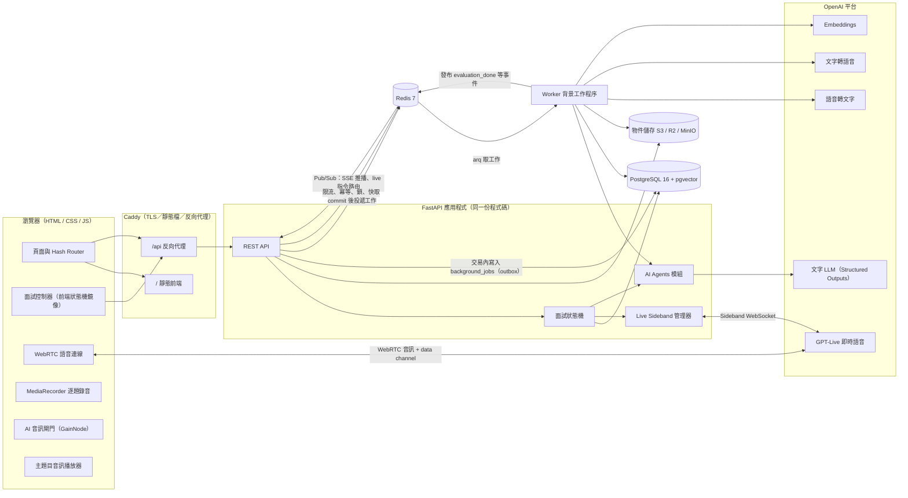
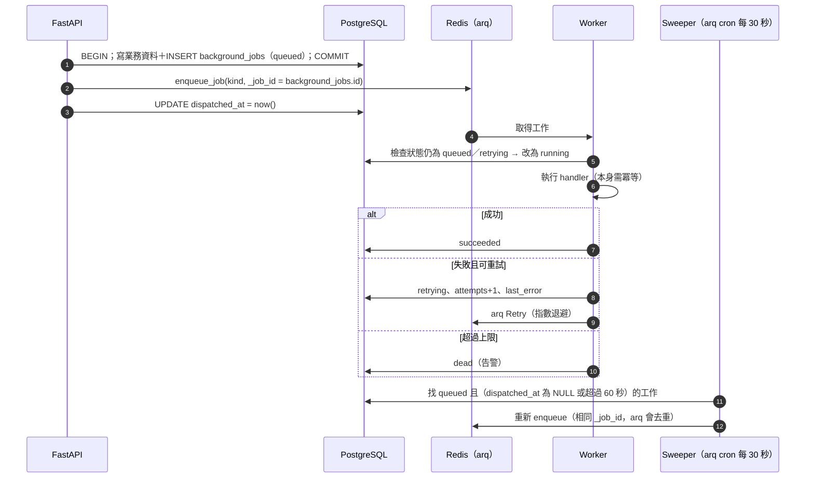
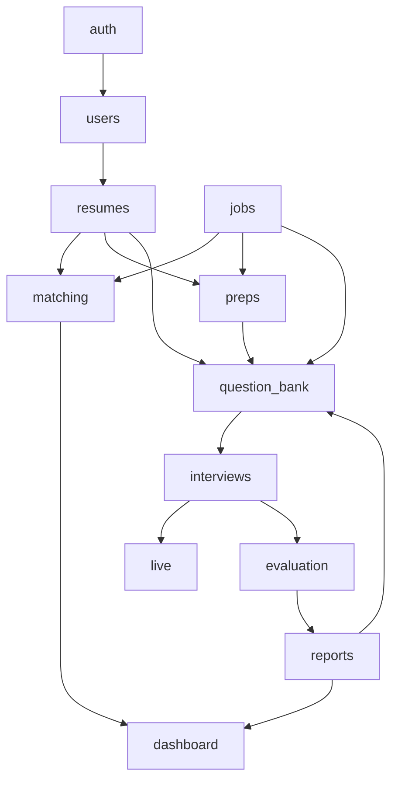
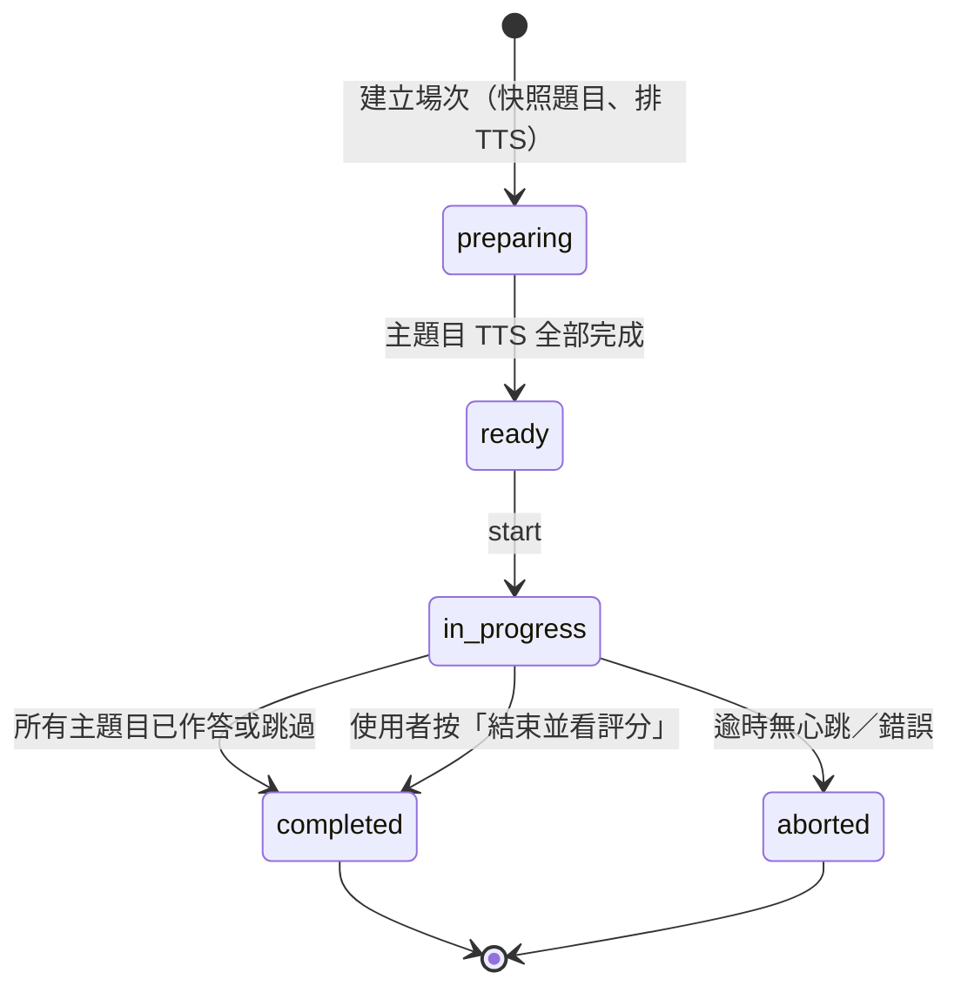
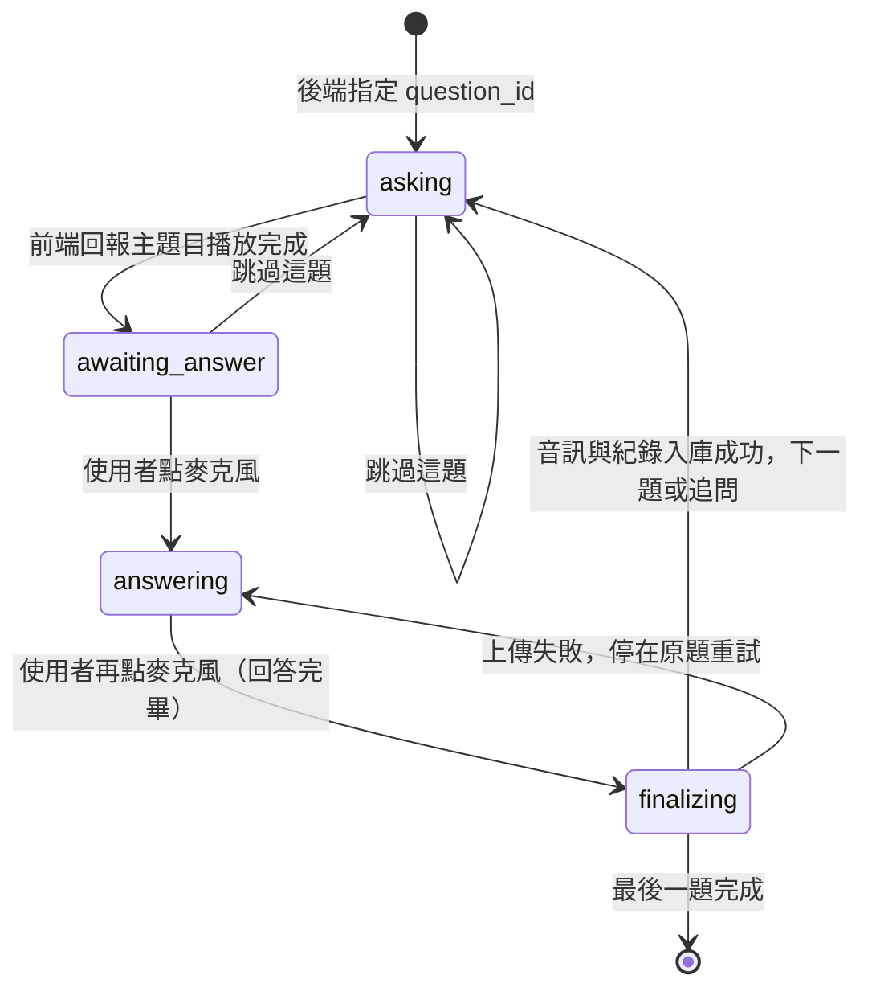
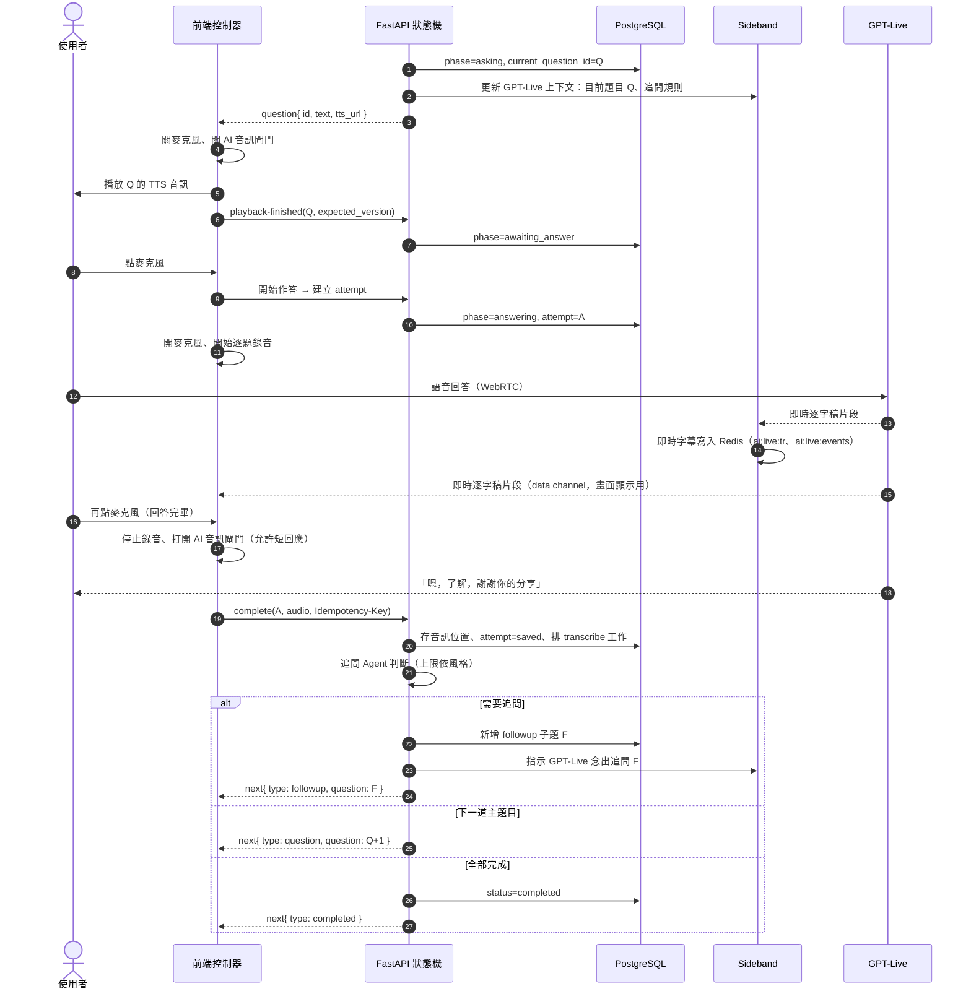

# AI Interview — 系統架構規劃書

> 版本：v0.1（MVP 規劃）・日期：2026-10-08
> 相關文件：[api.md](api.md)（API 規格）・[postgresql.md](postgresql.md)（資料庫與 ER 圖）・[flows.md](flows.md)（各功能流程圖）・[AI Interview.html](AI%20Interview.html)（UI 設計稿）

---

## 1. 產品定位與核心原則

**核心賣點**：使用者針對**指定職缺**持續練習；系統讀取**履歷＋職缺**產生面試題目，用**擬真語音面試官**逐題提問，最後針對**每一題**給出評分與口語改善建議。

整套架構建立在一個原則上：

> **系統掌控題目與紀錄，語音模型只負責擬真互動。**
>
> 題目順序、目前是第幾題、能不能進下一題、回答有沒有存好，全部由後端狀態機與資料庫決定。GPT‑Live 只負責「聽、自然接話、在被允許時追問」，不能自行換題或結束題目。

產品驗收條件（貫穿所有設計）：

1. 一場完成的面試，每一道規劃的主題目都有**播放紀錄**。
2. 每一題已作答的題目，都能查回**原題、考生音訊、完整逐字稿、評分與改善建議**。
3. 使用者日後修改履歷或題庫，**舊報告不受影響**（快照）。

---

## 2. UI 設計稿功能盤點

依 `AI Interview.html` 原型整理，共 7 個頁面：

| 頁面 | 路由 | 功能 | 對應後端模組 |
|---|---|---|---|
| 首頁 | `#home` | 問候、上次分數與弱項提示、分數趨勢圖、連續練習天數、最近面試列表、今日小提醒、推薦職缺 | `dashboard` |
| AI 語音面試 | `#interview` | **設定**：職缺、面試長度（快速 3 題／標準 5 題／深入 8 題）、面試官風格（溫和引導／真實模擬／壓力面試）、語言（中文／English／中英混合）、題目來源（題組）<br>**進行中**：錄音計時、進度條、Ava 說話動畫、主題目文字、麥克風按鈕（點一下開始回答、再點一下結束）、跳過這題、結束並看評分、即時逐字稿 | `interviews`、`live` |
| 面試評分 | `#report` | 總分環、與上次比較、五維度分數（內容結構／專業深度／表達流暢／職缺契合／自信程度）、贅詞次數、平均每題時間、語速；**逐題回顧**：題目、逐字稿（標示重點句）、做得好的地方、改善建議、「可以這樣說」；加入題庫複習、再練一次 | `reports`、`evaluation` |
| 面試建議 | `#prep` | 選職缺與履歷、重新生成、契合度、整體評語、你的優勢、需要補強、面試前準備清單（可勾選）、高機率會問的方向（含機率）、可能被問的題目（為什麼會問＋回答建議）、全部加入題庫 | `preps` |
| 題目生成與編輯 | `#questions` | 生成參數：目標職缺、題目類型（可複選）、難度、題數 3–10、補充需求；題組：上移／下移、編輯、刪除、新增題目 | `question_bank` |
| 職缺找尋 | `#jobs` | 關鍵字搜尋、地區、快速篩選（外商／英文環境／遠端／混合／契合度 80%+）、依契合度排序、職缺詳情（關於、工作內容、條件）、生成面試建議、模擬面試、收藏 | `jobs`、`matching` |
| 個人檔案與履歷 | `#profile` | 基本資料、大頭貼、履歷上傳（PDF／Word，10 MB 內）與 AI 解析結果（亮點／可以更好）、工作經歷、完整度、技能標籤、求職意向（職位、地點、期望月薪、作品集） | `users`、`resumes` |

UI 原型沒有、但上線必須補上的：**登入／註冊**、**錄音同意說明**、**面試歷史列表**、**自訂職缺（貼上 JD）**。最後一項很重要：使用者練習的職缺多半不在平台職缺庫裡。

---

## 3. 整體架構



### 3.1 部署單元

| 程序 | 啟動方式 | 職責 | MVP 數量 |
|---|---|---|---|
| `web` | Caddy | HTTPS、靜態前端、`/api` 反向代理、WebSocket 升級 | 1 |
| `api` | `uvicorn app.main:app` | REST API、面試狀態機、**持有 Sideband WebSocket** | 1（見 §9 擴展） |
| `worker` | `arq app.workers.settings.WorkerSettings` | 履歷解析、題目生成、TTS、轉錄、評分、報告、Embedding、排程工作 | 1–N |
| `postgres` | 託管服務或容器 | 業務資料（唯一真實來源）、工作紀錄（outbox）、Log | 1 |
| `redis` | 託管服務或容器（Redis 7） | 工作佇列 broker、Pub/Sub、限流、冪等鍵、分散式鎖、快取、面試即時暫存 | 1 |
| `object storage` | S3 / Cloudflare R2（開發用 MinIO） | 履歷原檔、主題目 TTS 音訊、逐題回答音訊、大頭貼 | — |

第一版用 **「一個模組化單體（modular monolith）＋一個 worker＋PostgreSQL＋Redis」**，不拆微服務。`api` 與 `worker` 共用同一份程式碼與資料模型。

---

## 4. 技術選型

### 4.1 總表

| 層 | 選擇 | 理由 | 替代方案（何時改） |
|---|---|---|---|
| 前端 | **原生 HTML / CSS / JavaScript（ES Modules）**，無建置步驟 | 沿用原型的 hash router 與元件寫法；面試頁需要直接操作 WebRTC、WebAudio、MediaRecorder，原生 API 最直接 | 頁面變多、需要型別檢查時加 Vite＋TypeScript（不換框架） |
| 前端樣式 | 沿用原型 CSS Variables（含深色模式） | 設計稿已完成 token | — |
| 後端框架 | **FastAPI**＋Pydantic v2 | 非同步、原生 WebSocket、OpenAPI 自動文件 | — |
| ORM／遷移 | **SQLAlchemy 2.0（async）＋asyncpg＋Alembic** | 成熟、支援 PostgreSQL 特性（JSONB、陣列、部分索引） | — |
| 主資料庫 | **PostgreSQL 16** | 交易一致性（狀態推進）、JSONB 存 AI 結構化輸出、陣列、部分索引、分區表 | — |
| 向量 | **pgvector**（PostgreSQL 擴充） | 職缺契合度排序用 embedding；不必另開向量資料庫 | 職缺量 > 百萬筆再評估 |
| 全文搜尋 | `pg_trgm` 三元組索引 | 中文斷詞在 PG 內建全文搜尋效果差，trigram 對中英混合關鍵字足夠 | 搜尋需求變重時改 Meilisearch / OpenSearch |
| 快取／訊息 | **Redis 7** | 佇列 broker、Pub/Sub、限流、冪等、鎖、快取，一個元件涵蓋多種需求；詳見 §4.3 | — |
| 背景工作佇列 | **arq（asyncio，Redis broker）＋PostgreSQL `background_jobs` 作 outbox** | arq 原生 async，和 FastAPI／asyncpg 共用同一套非同步程式碼；內建重試、逾時、cron。Outbox 確保「資料寫了，工作一定會排」 | 需要多語言 worker 或複雜工作流程時改 Celery / Temporal |
| 物件儲存 | **S3 相容**（正式：AWS S3 或 Cloudflare R2；開發：MinIO） | 音訊與履歷不進資料庫；預簽名 URL 讓前端直接下載 | — |
| 即時語音 | **GPT‑Live（WebRTC＋後端 Sideband）** | 擬真聆聽、接話、插話處理 | 見 §6.6 降級模式 |
| 文字 LLM | OpenAI Responses API＋**Structured Outputs（JSON Schema）** | 題目、評分輸出必須可驗證後才入庫 | 抽象成 `LLMClient`，未來可換供應商 |
| STT（最終逐字稿） | OpenAI 語音轉文字（檔案轉錄） | 以**逐題完整錄音**轉錄，不拼接即時字幕 | — |
| TTS（主題目） | OpenAI TTS | 主題目由應用程式播放，確保措辭與播放完成時間 | — |
| 履歷解析 | `pypdf` / `pdfplumber`、`python-docx`；掃描檔再丟 LLM 視覺讀取 | 先抽文字，再用 LLM 結構化 | — |
| 認證 | Email＋密碼（argon2）、Google OAuth；Access JWT（15 分）＋Refresh Token（httpOnly Cookie，DB 存雜湊、輪替） | 前後端同網域，Cookie 最省事又安全 | — |
| Log／觀測 | 結構化 stdout（`structlog`）＋**PostgreSQL 分區表**（LLM 呼叫、Live 事件、產品事件）＋Sentry | 見 §8 | — |
| 部署 | Docker Compose（開發與 MVP）；正式環境用支援長連線 WebSocket 的容器平台＋託管 PostgreSQL＋託管 Redis | Sideband 需長連線 | — |

### 4.2 為什麼 Log 用 PostgreSQL，而不是 MongoDB

| 考量 | PostgreSQL（建議） | MongoDB |
|---|---|---|
| 維運元件數 | 0 個新增 | 多一套叢集、備份、監控 |
| 與業務資料關聯 | 可直接 `JOIN interview_sessions`、算每位使用者成本 | 需在應用層組合 |
| 半結構化 payload | `JSONB`＋GIN 索引足夠 | 原生強項 |
| 大量寫入與清理 | **按月分區**，過期直接 `DROP PARTITION`，不留碎片 | TTL index |
| 何時該換 | — | 單日事件量到千萬筆以上、或需要彈性分片時 |

結論：**持久保存的 Log 用 PostgreSQL**；Redis 只當高頻事件的暫存緩衝（見 §4.3），不當 log 的最終存放處。系統運行 log（stdout）另外送到 log 平台（如 Grafana Loki、CloudWatch），不進資料庫。

### 4.3 Redis 使用規劃

**定位：Redis 存「短命、高頻、跨程序協調」的資料；PostgreSQL 是唯一的真實來源。** Redis 資料全部遺失時，系統要能自動恢復，不能遺失面試題目、作答紀錄或評分。

#### 4.3.1 用途

| 用途 | 說明 | 為什麼不用 PostgreSQL |
|---|---|---|
| **工作佇列 broker** | arq 佇列；分 `interactive`（面試中的 TTS、轉錄、追問用的快速轉錄）與 `default`（解析、生成、評分、報告）兩條，各自有 worker，避免批次工作塞住面試 | 低延遲取工作、不用輪詢資料庫 |
| **Pub/Sub** | ① worker 完成評分 → 推給持有 SSE 連線的 API 實例；② API 實例 → 持有 sideband 的實例（多實例時路由 live 指令） | 跨程序即時通知 |
| **Live 即時暫存** | 作答中的即時字幕片段、sideband 事件先寫 Redis Stream，再批次寫入 `live_events` | 字幕片段每秒數筆，逐筆寫 PG 浪費 |
| **限流** | 登入失敗鎖定、題目生成、建立面試、AI 端點 | 計數器高頻寫入、自動過期 |
| **冪等鍵** | 所有帶 `Idempotency-Key` 的 POST，24 小時內回傳同一結果 | 自動過期；處理中狀態防止並發重送 |
| **分散式鎖** | 同一題組同時只有一個生成工作、同一場報告只建一次、sideband 擁有者租約 | `SET NX PX` 自動過期，不怕程序當掉留下死鎖 |
| **快取** | Dashboard、職缺搜尋結果、TTS 音訊位置對照 | 減少重複查詢 |

**不放進 Redis 的**：面試狀態與題目進度（只在 PostgreSQL，靠 `state_version` 控制）、作答紀錄、評分、refresh token、任何沒有 TTL 又無法重建的資料。

#### 4.3.2 Key 設計

所有 key 以 `ai:` 為前綴（同一個 Redis 給多環境用時改成 `ai:{env}:`）。

| 用途 | Key | 型別 | TTL |
|---|---|---|---|
| 工作佇列 | `arq:queue:interactive`、`arq:queue:default`（arq 管理） | ZSET 等 | arq 管理 |
| 冪等 | `ai:idem:{user_id}:{idempotency_key}` | HASH `{state: processing\|done, status_code, body}` | 24 h |
| 限流 | `ai:rl:{action}:{user_id}:{window_start}` | STRING（INCR） | 視窗長度 |
| 登入失敗 | `ai:rl:login_fail:{sha256(email)}` | STRING（INCR） | 15 min |
| 鎖：題目生成 | `ai:lock:qgen:{set_id}` | STRING（擁有者 token） | 120 s |
| 鎖：報告 | `ai:lock:report:{session_id}` | STRING | 60 s |
| Sideband 擁有者 | `ai:live:owner:{session_id}` | STRING（instance_id） | 30 s，每 10 秒續約 |
| Live 指令頻道 | `ai:live:cmd:{session_id}` | Pub/Sub channel | — |
| 即時字幕緩衝 | `ai:live:tr:{attempt_id}` | LIST（RPUSH 片段） | 2 h |
| Live 事件串流 | `ai:live:events` | STREAM（consumer group `pg-flusher`） | `MAXLEN ~ 100000` |
| 報告進度推播 | `ai:evt:report:{session_id}` | Pub/Sub channel | — |
| 快取：Dashboard | `ai:cache:dash:{user_id}` | STRING（JSON） | 60 s；報告完成時主動刪除 |
| 快取：職缺搜尋 | `ai:cache:jobs:{resume_id}:{sha1(query)}` | STRING（JSON） | 120 s |
| 快取：TTS | `ai:cache:tts:{sha1(text, voice, lang)}` | STRING（物件 key） | 30 天 |

#### 4.3.3 工作投遞：Outbox 模式

只用 Redis 佇列會有一個漏洞：資料庫交易成功、但投遞 Redis 前程序當掉，工作就消失了。所以保留 `background_jobs` 表當 **outbox**：



- `_job_id` 用資料庫 ID，重複投遞不會重複執行。
- Redis 整個清空時，sweeper 會把所有未完成工作從 PostgreSQL 重新投遞。

#### 4.3.4 設定與故障時的行為

- 版本 Redis 7；`appendonly yes`、`appendfsync everysec`；`maxmemory-policy noeviction`（佇列資料不可被淘汰，所以**所有快取 key 一定要設 TTL**）。
- 正式環境用託管服務（AWS ElastiCache、GCP Memorystore 等），開啟 TLS 與密碼；與 API／worker 同區域。
- Python 用 `redis-py`（`redis.asyncio`）與 `arq`。

| Redis 故障時 | 行為 |
|---|---|
| 工作佇列 | 工作仍寫在 `background_jobs`；面試**可以繼續進行**（狀態在 PG），報告延後；Redis 恢復後 sweeper 補投遞 |
| 冪等 | 面試回答上傳退回使用 `answer_attempts.idempotency_key` 唯一約束，關鍵路徑不受影響；其他端點暫時不保證冪等 |
| 限流 | Fail-open，改用程序內記憶體 token bucket；登入失敗鎖定暫時改為較嚴格的單機計數 |
| Pub/Sub | SSE 失效，前端自動改為輪詢報告 |
| 即時字幕緩衝 | 追問判斷改用剛上傳音訊做快速轉錄（見 [flows.md §15](flows.md)） |
| Sideband 擁有者租約 | 單實例部署不受影響；多實例時暫停新的 live 連線，改用 `scripted` 模式 |

---

## 5. 後端模組設計

### 5.1 目錄結構

```
backend/
├── app/
│   ├── main.py                 # FastAPI app、router 掛載、lifespan（啟動 sideband 管理器）
│   ├── core/
│   │   ├── config.py           # pydantic-settings，所有模型名稱、金鑰、上限皆由環境變數設定
│   │   ├── db.py               # async engine / session
│   │   ├── security.py         # 密碼雜湊、JWT、Cookie
│   │   ├── errors.py           # 統一錯誤格式
│   │   ├── storage.py          # S3 客戶端、預簽名 URL
│   │   ├── redis.py            # redis.asyncio 連線池、key 命名、鎖、限流、冪等 middleware
│   │   └── logging.py          # structlog、request_id
│   ├── modules/
│   │   ├── auth/               # 註冊、登入、OAuth、refresh
│   │   ├── users/              # 個人檔案、技能、經歷、完整度
│   │   ├── resumes/            # 上傳、解析、主要履歷
│   │   ├── jobs/               # 職缺庫、自訂職缺、收藏、搜尋
│   │   ├── matching/           # 契合度（embedding 粗排）
│   │   ├── preps/              # 面試建議
│   │   ├── question_bank/      # 題組、題目生成、排序
│   │   ├── interviews/         # 面試場次、狀態機、作答紀錄 ← 核心
│   │   ├── live/               # GPT-Live 連線、sideband、音訊閘門指令
│   │   ├── evaluation/         # 逐題轉錄＋評分
│   │   ├── reports/            # 報告彙整、SSE 進度
│   │   └── dashboard/          # 首頁彙整
│   │   # 每個模組：router.py / schemas.py / models.py / service.py / repository.py
│   ├── ai/
│   │   ├── client.py           # LLMClient：重試、逾時、寫入 llm_calls
│   │   ├── prompts/            # 版本化提示詞（*.md，含 prompt_version）
│   │   ├── schemas/            # 每個 agent 的 JSON Schema
│   │   └── agents/             # 見 §7
│   └── workers/
│       ├── queue.py            # enqueue：寫 outbox＋投遞 arq；狀態更新
│       ├── settings.py         # arq WorkerSettings（interactive / default 兩組）
│       ├── cron.py             # sweeper、閒置場次、音訊清理、分區維護、live 事件寫入 PG
│       └── handlers/           # 每種 job kind 一個 handler
├── alembic/
└── tests/

frontend/
├── index.html
├── css/                         # 沿用設計稿 token
└── js/
    ├── main.js / router.js / state.js
    ├── api.js                   # fetch 包裝：自動 refresh、錯誤格式、Idempotency-Key
    ├── pages/                   # home / interview / report / prep / questions / jobs / profile / login
    └── interview/
        ├── controller.js        # 前端狀態機（只鏡像後端狀態，不自行推進）
        ├── rtc.js               # WebRTC 連線、data channel 事件
        ├── recorder.js          # 逐題 MediaRecorder（複製麥克風 track）
        ├── audio-gate.js        # 控制 AI 語音是否能被使用者聽到
        └── question-player.js   # 播放主題目 TTS 音訊
```

### 5.2 模組責任與相依



規則：模組之間只透過 `service.py` 互相呼叫，不直接讀別人的 repository；`interviews` 是唯一可以改變面試狀態的模組。

---

## 6. 核心設計：系統掌控題目的即時語音面試

### 6.1 責任切分

| 誰 | 負責 | 不負責 |
|---|---|---|
| **後端狀態機** | 目前題目、階段推進、追問次數上限、作答紀錄、結束條件 | 產生語音 |
| **主題目 TTS 音訊** | 一字不差念出資料庫裡的題目，前端可確認「播放完成」 | 互動 |
| **GPT‑Live** | 聆聽、短回應（「嗯，了解」）、被允許時念出追問、處理「我想一下」 | 決定下一題、宣布結束 |
| **前端控制器** | 播放主題目、開關麥克風、開關 AI 音訊閘門、逐題錄音並上傳 | 自行推進題號 |
| **Worker** | 最終轉錄、逐題評分、報告 | 即時互動 |

### 6.2 面試場次與題目階段

場次有兩層狀態：`status`（整場生命週期）與 `phase`（目前題目的階段）。





**每次狀態推進**都是一筆資料庫交易，並帶 `expected_version` 做樂觀鎖（詳見 [postgresql.md §6](postgresql.md)）。前端重送、斷線重連都不會跳題。

### 6.3 一題的完整時序（live 模式）



### 6.4 GPT‑Live 的控制手段（由強到弱）

1. **資料層控制（最強）**：只有後端能建立 `session_questions` 與 `answer_attempts`。模型講了什麼都不會改變題號。
2. **音訊閘門**：前端把 GPT‑Live 的遠端音軌接到 WebAudio `GainNode`，**只有在後端允許的時段**（回答後短回應、追問播放、結尾）才打開。主題目播放期間關閉，使用者不會聽到模型自行出題。
3. **麥克風閘門**：主題目播放時 `track.enabled = false`，避免模型聽到 TTS 回音而搶答。
4. **Sideband 上下文更新**：每題開始時，後端把「目前題目、考察重點、允許行為」送給 GPT‑Live。
5. **系統提示詞（最弱，只是輔助）**：

```text
你是 {company} 的面試官 Ava，風格：{persona}，語言：{language}。
主題目由應用程式播放，你不得自行提出新的主題目，也不得宣布本題結束或開始下一題。
考生回答時安靜聆聽；考生說「我想一下」時給予鼓勵並等待。
應用程式通知「回答結束」後，你只能用一句話自然回應（10 字以內），不評論對錯。
收到「請追問」指示時，念出指定的追問內容，可微調語氣，但不得改變問題意思。
```

> 官方說明：sideband 送出的修正無法收回使用者已聽到的聲音，所以**音訊閘門是必要的**，提示詞不能當保證。

### 6.5 回答結束的判定

- **主要方式**：使用者點麥克風（設計稿已是「點一下開始、再點一下結束」）。
- **輔助方式**：靜音超過 `ANSWER_SILENCE_PROMPT_SEC`（預設 12 秒），前端打開閘門，讓 GPT‑Live 問「這題還有要補充的嗎？」；**不自動切題**。
- **上限**：單題作答超過 `ANSWER_MAX_SEC`（預設 300 秒）前端自動結束並上傳。
- **硬性規則**：音訊上傳成功且 `answer_attempts` 寫入成功，才能進下一題；失敗則停在原題重試。

### 6.6 語音模式（`voice_mode`）

| 模式 | 說明 | 用途 |
|---|---|---|
| `live` | TTS 主題目＋GPT‑Live 聆聽與接話＋動態追問 | 主要產品體驗 |
| `scripted` | TTS 主題目＋逐題錄音，**不連 GPT‑Live**；追問用 TTS 即時合成 | ① 開發第一階段 ② GPT‑Live 連線失敗時自動降級 ③ 免費方案控制成本 |

兩種模式共用**同一套狀態機、同一套 API、同一套評分管線**，差別只在前端是否建立 WebRTC 與後端是否開 sideband。因此可以先把 `scripted` 做穩，再接 GPT‑Live。

### 6.7 追問規則

| 面試官風格 | 每道主題目追問上限 | 觸發條件 |
|---|---|---|
| 溫和引導 `warm` | 0–1 | 回答過短（< 40 字）或明顯離題 |
| 真實模擬 `real` | 1 | 缺少評分規準中的關鍵要點 |
| 壓力面試 `tough` | 2 | 缺少細節、數據、取捨理由 |

追問 Agent 在 `complete` 請求中**同步**執行，逾時 3 秒即視為「不追問」。等待期間 GPT‑Live 的短回應會蓋過這段延遲。追問以 `parent_id` 掛在主題目下，獨立保存題目原文、實際念出的內容、回答與評分。

### 6.8 斷線與重連

- 前端每 15 秒送 `heartbeat`；超過 `SESSION_IDLE_TIMEOUT_SEC`（預設 10 分鐘）無心跳，worker 將場次標記 `aborted`，已完成的題目仍會評分。
- 重新整理頁面後，前端呼叫 `GET /interviews/{id}` 取得 `phase` 與目前題目，**從目前題目重新開始**。若斷在 `answering`，舊 attempt 標記 `interrupted`，以 `attempt_no + 1` 重答。
- GPT‑Live 斷線：自動重連一次；再失敗則降級為 `scripted` 模式繼續面試，並在場次上記錄 `voice_mode_degraded_at`。

---

## 7. AI Agents 設計

這裡的 Agent 只用在**需要模型判斷**的地方；進度控制與資料寫入一律用一般程式碼。每個 Agent 都是「輸入組裝 → LLM（Structured Outputs）→ 程式驗證 → 入庫」，並記錄 `model`、`prompt_version`。

| Agent | 觸發 | 輸入 | 輸出（JSON Schema） | 程式端驗證 | 模型等級 |
|---|---|---|---|---|---|
| **Resume Parser** | 上傳履歷 | 抽出的文字 | 基本資料、經歷、技能、專案、量化成果；履歷亮點／可以更好 | 欄位型別、日期合法 | 快速 |
| **JD Parser** | 使用者貼上職缺 | JD 原文 | 公司、職稱、地點、工作內容、條件、標籤 | 必填欄位 | 快速 |
| **Match Scorer** | 履歷或職缺更新 | 履歷與職缺 embedding | 0–100 契合度（cosine 換算） | — | Embedding |
| **Prep Analyzer** | 面試建議頁 | 履歷結構化資料＋職缺 | 契合度、評語、優勢、補強、準備清單、高機率方向（含機率）、可能題目（原因＋建議） | 機率 0–100、清單 ≤ 8 項 | 推理 |
| **Question Planner** | 題目生成 | 履歷、職缺、題型、難度、題數、補充需求、既有題目 | 題目陣列：類型、難度、題目、考察能力、預期要點、評分規準、出題理由 | 題數相符、類型覆蓋、與既有題去重（trigram 相似度 > 0.6 剔除）、長度 ≤ 120 字 | 推理 |
| **Follow-up Decider** | 每題 `complete` | 題目、規準、即時逐字稿、風格、已追問次數 | `{ should_follow_up, question, reason }` | 未超過上限、3 秒逾時 | 快速 |
| **Answer Evaluator** | 每題最終逐字稿完成 | 題目、規準、職缺摘要、必要履歷背景、完整逐字稿、追問與回答 | 分數、五維度、證據原句、做得好、改善建議、可以這樣說、重點句 | **證據原句必須出現在逐字稿中**，否則剔除；逐字稿過短或品質差 → `needs_review` | 推理 |
| **Report Aggregator** | 所有題目評分完成 | 各題評分 | 總結評語、共同弱點、下次練習優先順序 | 總分由程式加權計算，**不讓模型算總分** | 快速 |

模型名稱全部透過環境變數設定（`LLM_MODEL_REASONING`、`LLM_MODEL_FAST`、`STT_MODEL`、`TTS_MODEL`、`EMBEDDING_MODEL`、`LIVE_MODEL`），不寫死在程式中。

### 7.1 評分輸出範例

```json
{
  "score": 68,
  "dimensions": { "structure": 60, "depth": 65, "fluency": 62, "job_fit": 78, "confidence": 55 },
  "evidence": ["我會先盤點各產品線現有的元件"],
  "strengths": ["有提到 design token 與 Storybook，方向正確", "知道要先盤點現況"],
  "improvements": ["「應該會用吧」讓回答聽起來不確定", "缺少版本策略與採用率追蹤"],
  "better_answer": "我會分四步：第一，訪談 5 個產品線……",
  "highlight": "嗯⋯我會先盤點",
  "needs_review": false
}
```

非模型計算的指標（由程式根據逐字稿與音訊長度計算）：

- **贅詞次數**：詞表比對（嗯、呃、那個、就是、然後、應該吧、um、uh、like…），詞表放在設定檔中，可依語言擴充。
- **語速**：中文以「字／分」、英文以「詞／分」，分母用實際說話時間。
- **平均每題時間**：`answer_ended_at - answer_started_at` 的平均。

---

## 8. Log 與觀測

| 類型 | 存放 | 保留 | 用途 |
|---|---|---|---|
| 應用程式 log | stdout JSON → log 平台 | 14 天 | 除錯、錯誤追蹤（附 `request_id`、`session_id`） |
| 例外 | Sentry | 依方案 | 告警 |
| `llm_calls` | PostgreSQL 月分區 | 13 個月 | 每次 LLM／STT／TTS／Live 呼叫的模型、token、音訊秒數、成本、延遲、錯誤 → **單場面試成本**、單位經濟 |
| `live_events` | 先寫 Redis Stream，每 2 秒批次寫入 PostgreSQL 月分區 | 30 天 | GPT‑Live sideband 原始事件；用於調查漏問、越界、轉錄問題 |
| `app_events` | PostgreSQL 月分區 | 13 個月 | 產品事件（開始面試、完成面試、生成題目…）＋稽核（登入、刪除履歷） |

需要持續監看的品質指標（產品成敗關鍵）：

| 指標 | 定義 | 目標 |
|---|---|---|
| 漏問率 | 已完成場次中，規劃主題目沒有 `asked_at` 的比例 | 0% |
| 錯誤切題率 | 有 `interrupted` 或重答 attempt 的題目比例 | < 3% |
| 回答入庫失敗率 | `complete` 最終失敗的比例 | < 0.5% |
| 轉錄失敗／需複查率 | `transcript_status in (failed, low_quality)` | < 2% |
| 越界語音次數 | sideband 偵測到模型在閘門關閉時輸出語音 | 監看趨勢 |
| 報告產出時間 | 場次結束到報告 ready 的 P95 | < 60 秒 |
| 單場成本 | 依 `llm_calls` 加總 | 監看 |

---

## 9. 非功能需求

### 9.1 安全與隱私

- 所有 OpenAI 金鑰只存在後端；WebRTC 的 SDP 交換由後端代理（見 [api.md](api.md) `live/connect`），前端拿不到任何金鑰。
- 履歷與錄音是個資：物件儲存開啟伺服器端加密；下載一律用 **5 分鐘有效的預簽名 URL**；資料庫連線走 TLS。
- 面試開始前需取得**錄音同意**（記錄在 `interview_sessions.recording_consent_at`）。
- 保留期限：回答音訊預設 180 天後刪除（逐字稿與評分保留）；使用者可隨時刪除單場面試或帳號（硬刪除音訊與履歷原檔）。
- 所有資料查詢都以 `user_id` 限定範圍；物件 key 以 `users/{user_id}/…` 為前綴。
- 上傳檢查：MIME 類型、檔案大小（履歷 10 MB、單題音訊 15 MB）、PDF 解析在 worker 中執行並設逾時。
- Rate limit：登入、題目生成、建立面試、AI 相關端點以使用者為單位限流，計數放在 Redis（固定視窗 INCR＋TTL），見 §4.3。

### 9.2 成本估算（單場標準面試 5 題、約 15 分鐘，需以官方最新定價重新確認）

| 項目 | 估算基礎 | 約略成本 |
|---|---|---|
| GPT‑Live 語音 | 先前討論的標價 US$0.05／分鐘 × 15 | ~US$0.75 |
| 主題目 TTS | 5 題 × 約 60 字（題組沒改時可重用快取） | 很低 |
| 最終轉錄 | 約 10 分鐘考生音訊 | 低 |
| 評分 | 5 次推理模型呼叫＋1 次彙整 | 中 |
| 題目生成／面試建議 | 每職缺一次，可重用 | 低 |

`scripted` 模式可省下 GPT‑Live 費用，適合當免費方案。

### 9.3 擴展路徑

| 階段 | 觸發點 | 做法 |
|---|---|---|
| 單機 | MVP | 1 個 `api`（持有 sideband）＋`interactive` 與 `default` worker 各 1 個＋Redis 1 個 |
| 多 API 實例 | 同時面試 > 約 200 場 | 把 sideband 拆成獨立 `live-gateway` 服務；以 `ai:live:owner:{session_id}` 租約決定擁有者，`api` 透過 Redis Pub/Sub `ai:live:cmd:{session_id}` 下指令 |
| 佇列吞吐 | 評分排隊時間變長 | 水平增加 `default` worker；`interactive` worker 獨立擴充，確保面試中延遲 |
| Redis 負載 | 記憶體或連線數吃緊 | 快取與佇列拆成兩個 Redis 實例（快取可用 `allkeys-lru`，佇列維持 `noeviction`） |
| 讀取壓力 | Dashboard／報告查詢變慢 | 加 read replica、報告 JSON 快取 |

---

## 10. 開發階段規劃

| 階段 | 範圍 | 完成標準 |
|---|---|---|
| **P0 基礎** | 認證、個人檔案、履歷上傳解析、自訂職缺、資料表與 Alembic、Redis＋arq worker 與 outbox、限流與冪等 middleware | 可上傳履歷並看到 AI 解析結果 |
| **P1 題目** | 題目生成與編輯、面試建議 | 題目明顯依履歷＋職缺客製；出題理由可追溯 |
| **P2 面試（scripted）** | 狀態機、TTS 主題目、逐題錄音上傳、轉錄、逐題評分、報告頁 | 符合 §1 三條驗收條件 |
| **P3 面試（live）** | GPT‑Live WebRTC、sideband、音訊閘門、短回應、動態追問、降級機制 | 漏問率 0%、錯誤切題率 < 3% |
| **P4 成長** | 職缺庫與契合度、首頁 Dashboard、加入題庫、趨勢、方案與用量限制 | — |

---

## 11. 待確認事項

以下涉及 GPT‑Live 的細節，依先前討論整理，**實作前須以 OpenAI 官方最新文件確認**：

1. WebRTC SDP 交換的端點與驗證方式（後端代理 SDP，或發短效 client secret）。
2. Sideband 連到同一場對話的方式，以及可下達的指令（更新指示、要求模型說出指定內容、取消回應）。
3. 能否關閉自動回應或 turn detection（若可以，`asking` 階段直接關閉；否則依靠音訊閘門）。
4. 即時逐字稿事件的格式與延遲；client delegation 事件的內容。
5. 計價方式與單場時長上限。

為了讓這些不確定性不影響其他程式碼，`live` 模組對外只提供 `LiveProvider` 介面：

```python
class LiveProvider(Protocol):
    async def connect(self, session: InterviewSession, sdp_offer: str) -> LiveConnection: ...
    async def set_question_context(self, conn: LiveConnection, q: SessionQuestion) -> None: ...
    async def allow_reaction(self, conn: LiveConnection) -> None: ...
    async def speak_followup(self, conn: LiveConnection, text: str) -> None: ...
    async def close(self, conn: LiveConnection) -> None: ...
```

先實作 `GptLiveProvider`；必要時可換成 Realtime API 實作，不影響狀態機。
