# AI Interview — 各功能系統流程圖

> 版本：v0.1・所有圖皆為 Mermaid 格式
> 相關文件：[architecture.md](architecture.md)・[api.md](api.md)・[postgresql.md](postgresql.md)

## 目錄

1. [註冊與登入](#1-註冊與登入)
2. [Token 自動更新](#2-token-自動更新)
3. [履歷上傳與 AI 解析](#3-履歷上傳與-ai-解析)
4. [個人檔案與完整度](#4-個人檔案與完整度)
5. [職缺搜尋與契合度](#5-職缺搜尋與契合度)
6. [自訂職缺（貼上 JD）](#6-自訂職缺貼上-jd)
7. [面試建議生成](#7-面試建議生成)
8. [題目生成（Question Planner Agent）](#8-題目生成question-planner-agent)
9. [題目編輯與排序](#9-題目編輯與排序)
10. [建立面試場次（快照＋TTS）](#10-建立面試場次快照tts)
11. [即時語音面試：連線](#11-即時語音面試連線)
12. [即時語音面試：逐題主流程](#12-即時語音面試逐題主流程)
13. [面試狀態機](#13-面試狀態機)
14. [前端音訊與麥克風閘門](#14-前端音訊與麥克風閘門)
15. [追問決策](#15-追問決策)
16. [回答上傳失敗與重試](#16-回答上傳失敗與重試)
17. [斷線重連與降級](#17-斷線重連與降級)
18. [跳過題目與提前結束](#18-跳過題目與提前結束)
19. [評分管線（轉錄 → 逐題評分 → 報告）](#19-評分管線轉錄--逐題評分--報告)
20. [查看報告與加入題庫](#20-查看報告與加入題庫)
21. [首頁 Dashboard](#21-首頁-dashboard)
22. [背景工作生命週期](#22-背景工作生命週期)
23. [AI 呼叫與 Log 記錄](#23-ai-呼叫與-log-記錄)
24. [使用者完整旅程](#24-使用者完整旅程)

---

## 1. 註冊與登入

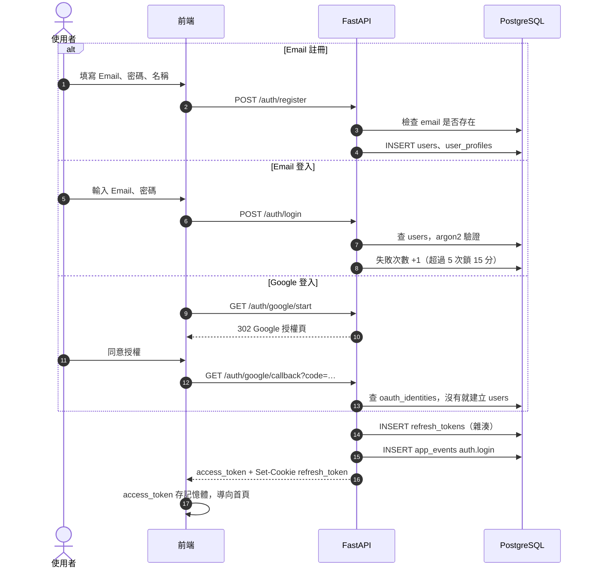
```mermaid
sequenceDiagram
    autonumber
    actor U as 使用者
    participant FE as 前端
    participant API as FastAPI
    participant DB as PostgreSQL

    alt Email 註冊
        U->>FE: 填寫 Email、密碼、名稱
        FE->>API: POST /auth/register
        API->>DB: 檢查 email 是否存在
        API->>DB: INSERT users、user_profiles
    else Email 登入
        U->>FE: 輸入 Email、密碼
        FE->>API: POST /auth/login
        API->>DB: 查 users，argon2 驗證
        API->>DB: 失敗次數 +1（超過 5 次鎖 15 分）
    else Google 登入
        FE->>API: GET /auth/google/start
        API-->>FE: 302 Google 授權頁
        U->>FE: 同意授權
        FE->>API: GET /auth/google/callback?code=…
        API->>DB: 查 oauth_identities，沒有就建立 users
    end
    API->>DB: INSERT refresh_tokens（雜湊）
    API->>DB: INSERT app_events auth.login
    API-->>FE: access_token + Set-Cookie refresh_token
    FE->>FE: access_token 存記憶體，導向首頁
```

## 2. Token 自動更新

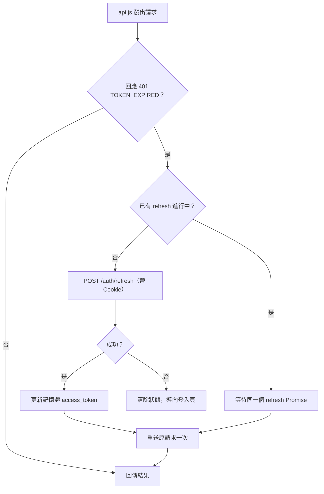
```mermaid
flowchart TD
    A["api.js 發出請求"] --> B{"回應 401 TOKEN_EXPIRED？"}
    B -- 否 --> Z["回傳結果"]
    B -- 是 --> C{"已有 refresh 進行中？"}
    C -- 是 --> D["等待同一個 refresh Promise"]
    C -- 否 --> E["POST /auth/refresh（帶 Cookie）"]
    E --> F{"成功？"}
    F -- 是 --> G["更新記憶體 access_token"]
    G --> H["重送原請求一次"]
    D --> H
    H --> Z
    F -- 否 --> I["清除狀態，導向登入頁"]
```

## 3. 履歷上傳與 AI 解析

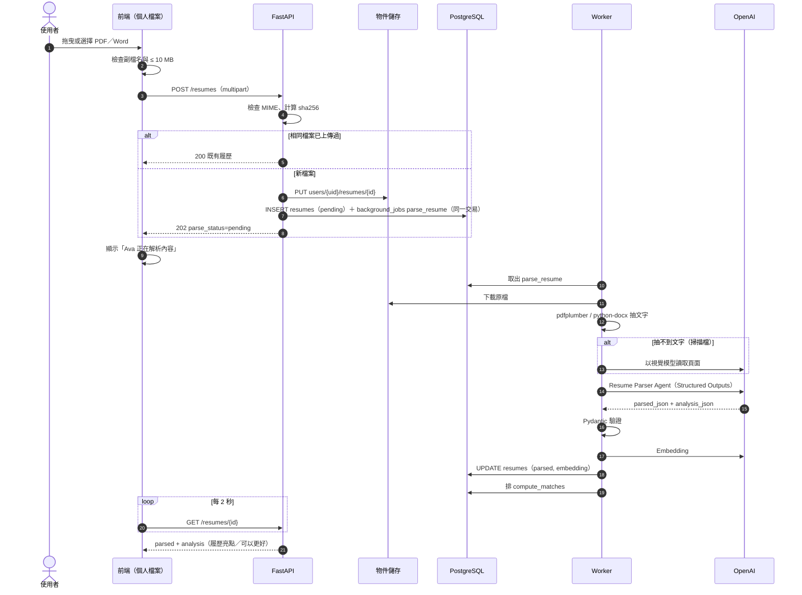
```mermaid
sequenceDiagram
    autonumber
    actor U as 使用者
    participant FE as 前端（個人檔案）
    participant API as FastAPI
    participant OBJ as 物件儲存
    participant DB as PostgreSQL
    participant W as Worker
    participant AI as OpenAI

    U->>FE: 拖曳或選擇 PDF／Word
    FE->>FE: 檢查副檔名與 ≤ 10 MB
    FE->>API: POST /resumes（multipart）
    API->>API: 檢查 MIME、計算 sha256
    alt 相同檔案已上傳過
        API-->>FE: 200 既有履歷
    else 新檔案
        API->>OBJ: PUT users/{uid}/resumes/{id}
        API->>DB: INSERT resumes（pending）＋ background_jobs parse_resume（同一交易）
        API-->>FE: 202 parse_status=pending
    end
    FE->>FE: 顯示「Ava 正在解析內容」
    W->>DB: 取出 parse_resume
    W->>OBJ: 下載原檔
    W->>W: pdfplumber / python-docx 抽文字
    alt 抽不到文字（掃描檔）
        W->>AI: 以視覺模型讀取頁面
    end
    W->>AI: Resume Parser Agent（Structured Outputs）
    AI-->>W: parsed_json + analysis_json
    W->>W: Pydantic 驗證
    W->>AI: Embedding
    W->>DB: UPDATE resumes（parsed, embedding）
    W->>DB: 排 compute_matches
    loop 每 2 秒
        FE->>API: GET /resumes/{id}
    end
    API-->>FE: parsed + analysis（履歷亮點／可以更好）
```

## 4. 個人檔案與完整度

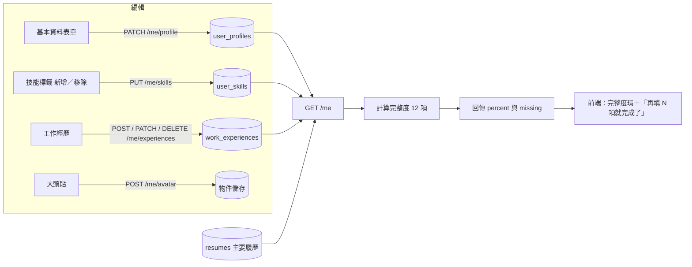
```mermaid
flowchart LR
    subgraph 編輯
        A["基本資料表單"] -->|"PATCH /me/profile"| S[(user_profiles)]
        B["技能標籤 新增／移除"] -->|"PUT /me/skills"| K[(user_skills)]
        C["工作經歷"] -->|"POST / PATCH / DELETE /me/experiences"| E[(work_experiences)]
        D["大頭貼"] -->|"POST /me/avatar"| O[(物件儲存)]
    end
    S --> G["GET /me"]
    K --> G
    E --> G
    R[("resumes 主要履歷")] --> G
    G --> H["計算完整度 12 項"]
    H --> I["回傳 percent 與 missing"]
    I --> J["前端：完整度環＋「再填 N 項就完成了」"]
```

## 5. 職缺搜尋與契合度

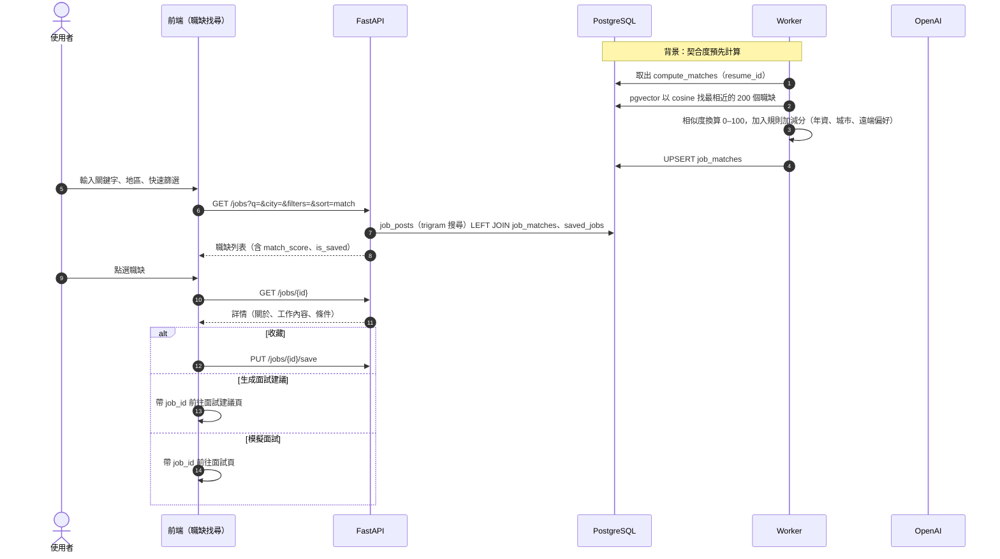
```mermaid
sequenceDiagram
    autonumber
    actor U as 使用者
    participant FE as 前端（職缺找尋）
    participant API as FastAPI
    participant DB as PostgreSQL
    participant W as Worker
    participant AI as OpenAI

    Note over W,DB: 背景：契合度預先計算
    W->>DB: 取出 compute_matches（resume_id）
    W->>DB: pgvector 以 cosine 找最相近的 200 個職缺
    W->>W: 相似度換算 0–100，加入規則加減分（年資、城市、遠端偏好）
    W->>DB: UPSERT job_matches

    U->>FE: 輸入關鍵字、地區、快速篩選
    FE->>API: GET /jobs?q=&city=&filters=&sort=match
    API->>DB: job_posts（trigram 搜尋）LEFT JOIN job_matches、saved_jobs
    API-->>FE: 職缺列表（含 match_score、is_saved）
    U->>FE: 點選職缺
    FE->>API: GET /jobs/{id}
    API-->>FE: 詳情（關於、工作內容、條件）
    alt 收藏
        FE->>API: PUT /jobs/{id}/save
    else 生成面試建議
        FE->>FE: 帶 job_id 前往面試建議頁
    else 模擬面試
        FE->>FE: 帶 job_id 前往面試頁
    end
```

## 6. 自訂職缺（貼上 JD）

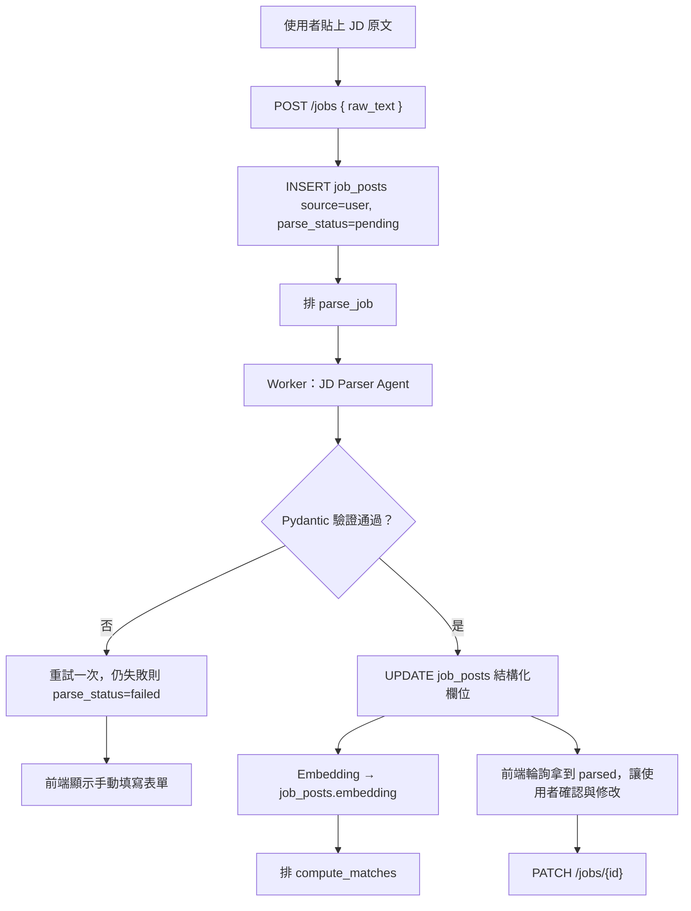
```mermaid
flowchart TD
    A["使用者貼上 JD 原文"] --> B["POST /jobs { raw_text }"]
    B --> C["INSERT job_posts source=user, parse_status=pending"]
    C --> D["排 parse_job"]
    D --> E["Worker：JD Parser Agent"]
    E --> F{"Pydantic 驗證通過？"}
    F -- 否 --> G["重試一次，仍失敗則 parse_status=failed"]
    G --> H["前端顯示手動填寫表單"]
    F -- 是 --> I["UPDATE job_posts 結構化欄位"]
    I --> J["Embedding → job_posts.embedding"]
    J --> K["排 compute_matches"]
    I --> L["前端輪詢拿到 parsed，讓使用者確認與修改"]
    L --> M["PATCH /jobs/{id}"]
```

## 7. 面試建議生成

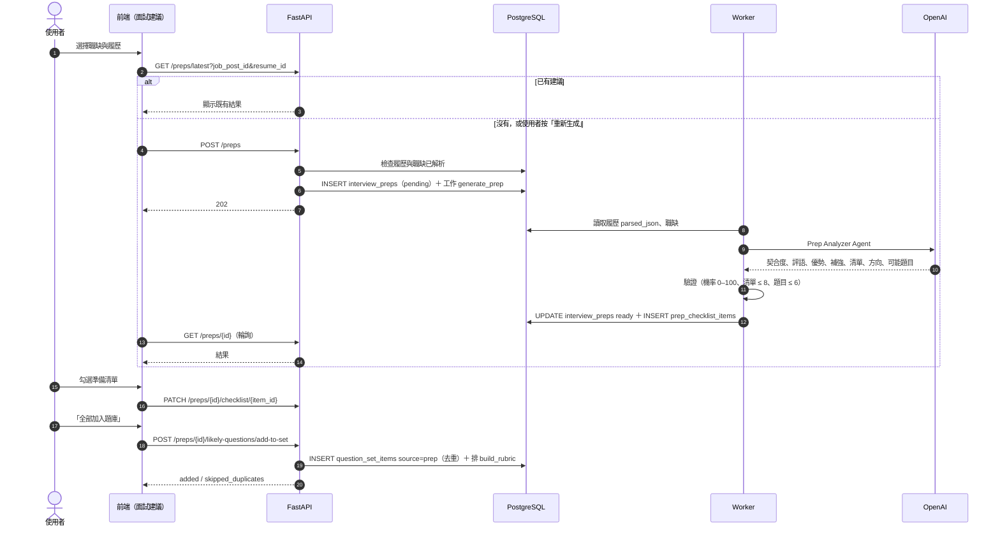
```mermaid
sequenceDiagram
    autonumber
    actor U as 使用者
    participant FE as 前端（面試建議）
    participant API as FastAPI
    participant DB as PostgreSQL
    participant W as Worker
    participant AI as OpenAI

    U->>FE: 選擇職缺與履歷
    FE->>API: GET /preps/latest?job_post_id&resume_id
    alt 已有建議
        API-->>FE: 顯示既有結果
    else 沒有，或使用者按「重新生成」
        FE->>API: POST /preps
        API->>DB: 檢查履歷與職缺已解析
        API->>DB: INSERT interview_preps（pending）＋ 工作 generate_prep
        API-->>FE: 202
        W->>DB: 讀取履歷 parsed_json、職缺
        W->>AI: Prep Analyzer Agent
        AI-->>W: 契合度、評語、優勢、補強、清單、方向、可能題目
        W->>W: 驗證（機率 0–100、清單 ≤ 8、題目 ≤ 6）
        W->>DB: UPDATE interview_preps ready ＋ INSERT prep_checklist_items
        FE->>API: GET /preps/{id}（輪詢）
        API-->>FE: 結果
    end
    U->>FE: 勾選準備清單
    FE->>API: PATCH /preps/{id}/checklist/{item_id}
    U->>FE: 「全部加入題庫」
    FE->>API: POST /preps/{id}/likely-questions/add-to-set
    API->>DB: INSERT question_set_items source=prep（去重）＋ 排 build_rubric
    API-->>FE: added / skipped_duplicates
```

## 8. 題目生成（Question Planner Agent）

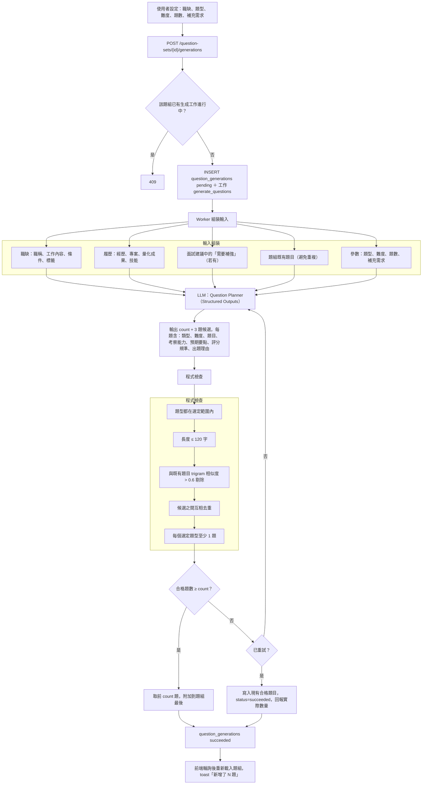
```mermaid
flowchart TD
    A["使用者設定：職缺、題型、難度、題數、補充需求"] --> B["POST /question-sets/{id}/generations"]
    B --> C{"該題組已有生成工作進行中？"}
    C -- 是 --> C1["409"]
    C -- 否 --> D["INSERT question_generations pending ＋ 工作 generate_questions"]
    D --> E["Worker 組裝輸入"]

    subgraph 輸入組裝
        E1["職缺：職稱、工作內容、條件、標籤"]
        E2["履歷：經歷、專案、量化成果、技能"]
        E3["面試建議中的「需要補強」（若有）"]
        E4["題組既有題目（避免重複）"]
        E5["參數：題型、難度、題數、補充需求"]
    end
    E --> E1 & E2 & E3 & E4 & E5

    E1 & E2 & E3 & E4 & E5 --> F["LLM：Question Planner（Structured Outputs）"]
    F --> G["輸出 count + 3 題候選，每題含：類型、難度、題目、考察能力、預期要點、評分規準、出題理由"]
    G --> H["程式檢查"]

    subgraph 程式檢查
        H1["題型都在選定範圍內"]
        H2["長度 ≤ 120 字"]
        H3["與既有題目 trigram 相似度 > 0.6 剔除"]
        H4["候選之間互相去重"]
        H5["每個選定題型至少 1 題"]
    end
    H --> H1 --> H2 --> H3 --> H4 --> H5

    H5 --> I{"合格題數 ≥ count？"}
    I -- 是 --> J["取前 count 題，附加到題組最後"]
    I -- 否 --> K{"已重試？"}
    K -- 否 --> F
    K -- 是 --> L["寫入現有合格題目，status=succeeded，回報實際數量"]
    J --> M["question_generations succeeded"]
    L --> M
    M --> N["前端輪詢後重新載入題組，toast「新增了 N 題」"]
```

## 9. 題目編輯與排序

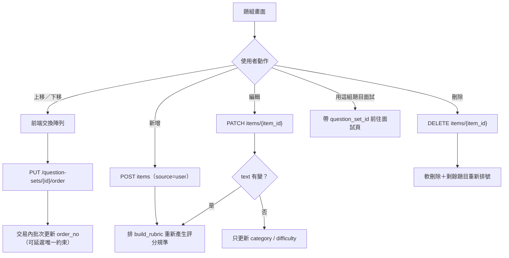
```mermaid
flowchart TD
    A["題組畫面"] --> B{"使用者動作"}
    B -- 上移／下移 --> C["前端交換陣列"] --> C1["PUT /question-sets/{id}/order"]
    C1 --> C2["交易內批次更新 order_no（可延遲唯一約束）"]
    B -- 編輯 --> D["PATCH items/{item_id}"] --> D1{"text 有變？"}
    D1 -- 是 --> D2["排 build_rubric 重新產生評分規準"]
    D1 -- 否 --> D3["只更新 category / difficulty"]
    B -- 新增 --> E["POST items（source=user）"] --> D2
    B -- 刪除 --> F["DELETE items/{item_id}"] --> F1["軟刪除＋剩餘題目重新排號"]
    B -- 用這組題目面試 --> G["帶 question_set_id 前往面試頁"]
```

## 10. 建立面試場次（快照＋TTS）

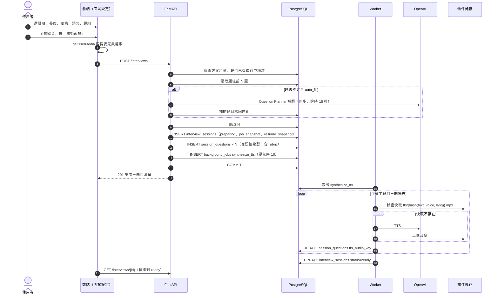
```mermaid
sequenceDiagram
    autonumber
    actor U as 使用者
    participant FE as 前端（面試設定）
    participant API as FastAPI
    participant DB as PostgreSQL
    participant W as Worker
    participant AI as OpenAI
    participant OBJ as 物件儲存

    U->>FE: 選職缺、長度、風格、語言、題組
    U->>FE: 同意錄音，按「開始面試」
    FE->>FE: getUserMedia 取得麥克風權限
    FE->>API: POST /interviews
    API->>DB: 檢查方案用量、是否已有進行中場次
    API->>DB: 讀取題組前 N 題
    alt 題數不足且 auto_fill
        API->>AI: Question Planner 補題（同步，逾時 15 秒）
        API->>DB: 補的題目寫回題組
    end
    API->>DB: BEGIN
    API->>DB: INSERT interview_sessions（preparing、job_snapshot、resume_snapshot）
    API->>DB: INSERT session_questions × N（從題組複製，含 rubric）
    API->>DB: INSERT background_jobs synthesize_tts（優先序 10）
    API->>DB: COMMIT
    API-->>FE: 201 場次＋題目清單
    W->>DB: 取出 synthesize_tts
    loop 每道主題目＋開場白
        W->>OBJ: 檢查快取 tts/{hash(text, voice, lang)}.mp3
        alt 快取不存在
            W->>AI: TTS
            W->>OBJ: 上傳音訊
        end
        W->>DB: UPDATE session_questions.tts_audio_key
    end
    W->>DB: UPDATE interview_sessions status=ready
    FE->>API: GET /interviews/{id}（輪詢到 ready）
```

## 11. 即時語音面試：連線

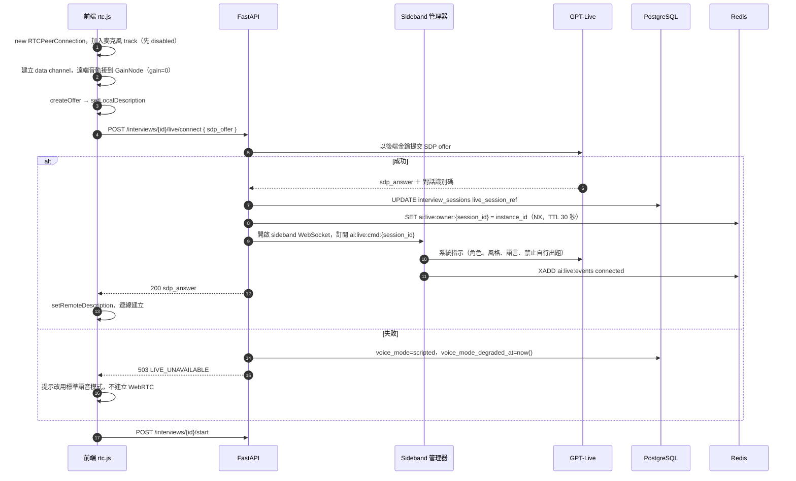
```mermaid
sequenceDiagram
    autonumber
    participant FE as 前端 rtc.js
    participant API as FastAPI
    participant SB as Sideband 管理器
    participant GL as GPT-Live
    participant DB as PostgreSQL
    participant RD as Redis

    FE->>FE: new RTCPeerConnection，加入麥克風 track（先 disabled）
    FE->>FE: 建立 data channel，遠端音軌接到 GainNode（gain=0）
    FE->>FE: createOffer → setLocalDescription
    FE->>API: POST /interviews/{id}/live/connect { sdp_offer }
    API->>GL: 以後端金鑰提交 SDP offer
    alt 成功
        GL-->>API: sdp_answer ＋ 對話識別碼
        API->>DB: UPDATE interview_sessions live_session_ref
        API->>RD: SET ai:live:owner:{session_id} = instance_id（NX，TTL 30 秒）
        API->>SB: 開啟 sideband WebSocket，訂閱 ai:live:cmd:{session_id}
        SB->>GL: 系統指示（角色、風格、語言、禁止自行出題）
        SB->>RD: XADD ai:live:events connected
        API-->>FE: 200 sdp_answer
        FE->>FE: setRemoteDescription，連線建立
    else 失敗
        API->>DB: voice_mode=scripted，voice_mode_degraded_at=now()
        API-->>FE: 503 LIVE_UNAVAILABLE
        FE->>FE: 提示改用標準語音模式，不建立 WebRTC
    end
    FE->>API: POST /interviews/{id}/start
```

## 12. 即時語音面試：逐題主流程

這是整個產品最關鍵的流程。主題目由**應用程式播放**，GPT‑Live 只在被允許的時段發聲。

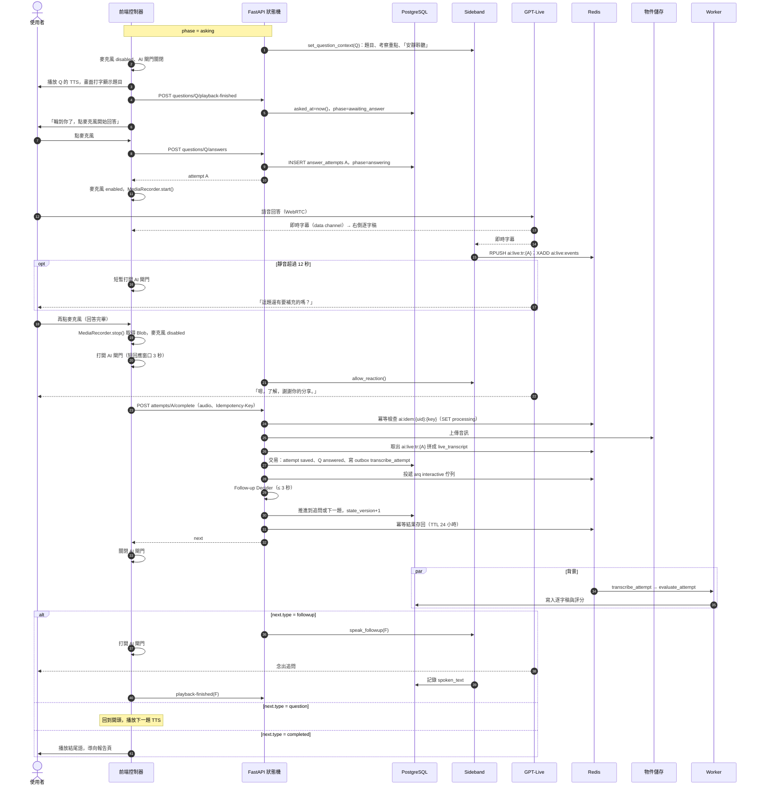
```mermaid
sequenceDiagram
    autonumber
    actor U as 使用者
    participant FE as 前端控制器
    participant API as FastAPI 狀態機
    participant DB as PostgreSQL
    participant SB as Sideband
    participant GL as GPT-Live
    participant RD as Redis
    participant OBJ as 物件儲存
    participant W as Worker

    Note over FE,API: phase = asking
    API->>SB: set_question_context(Q)：題目、考察重點、「安靜聆聽」
    FE->>FE: 麥克風 disabled、AI 閘門關閉
    FE->>U: 播放 Q 的 TTS，畫面打字顯示題目
    FE->>API: POST questions/Q/playback-finished
    API->>DB: asked_at=now()，phase=awaiting_answer
    FE->>U: 「輪到你了，點麥克風開始回答」

    U->>FE: 點麥克風
    FE->>API: POST questions/Q/answers
    API->>DB: INSERT answer_attempts A，phase=answering
    API-->>FE: attempt A
    FE->>FE: 麥克風 enabled，MediaRecorder.start()
    U->>GL: 語音回答（WebRTC）
    GL-->>FE: 即時字幕（data channel）→ 右側逐字稿
    GL-->>SB: 即時字幕
    SB->>RD: RPUSH ai:live:tr:{A}；XADD ai:live:events

    opt 靜音超過 12 秒
        FE->>FE: 短暫打開 AI 閘門
        GL-->>U: 「這題還有要補充的嗎？」
    end

    U->>FE: 再點麥克風（回答完畢）
    FE->>FE: MediaRecorder.stop() 取得 Blob，麥克風 disabled
    FE->>FE: 打開 AI 閘門（短回應窗口 3 秒）
    API->>SB: allow_reaction()
    GL-->>U: 「嗯，了解，謝謝你的分享。」
    FE->>API: POST attempts/A/complete（audio、Idempotency-Key）
    API->>RD: 冪等檢查 ai:idem:{uid}:{key}（SET processing）
    API->>OBJ: 上傳音訊
    API->>RD: 取出 ai:live:tr:{A} 拼成 live_transcript
    API->>DB: 交易：attempt saved、Q answered、寫 outbox transcribe_attempt
    API->>RD: 投遞 arq interactive 佇列
    API->>API: Follow-up Decider（≤ 3 秒）
    API->>DB: 推進到追問或下一題，state_version+1
    API->>RD: 冪等結果存回（TTL 24 小時）
    API-->>FE: next
    FE->>FE: 關閉 AI 閘門

    par 背景
        RD->>W: transcribe_attempt → evaluate_attempt
        W->>DB: 寫入逐字稿與評分
    end

    alt next.type = followup
        API->>SB: speak_followup(F)
        FE->>FE: 打開 AI 閘門
        GL-->>U: 念出追問
        SB->>DB: 記錄 spoken_text
        FE->>API: playback-finished(F)
    else next.type = question
        Note over FE: 回到開頭，播放下一題 TTS
    else next.type = completed
        FE->>U: 播放結尾語，導向報告頁
    end
```

## 13. 面試狀態機

### 13.1 場次生命週期（`status`）

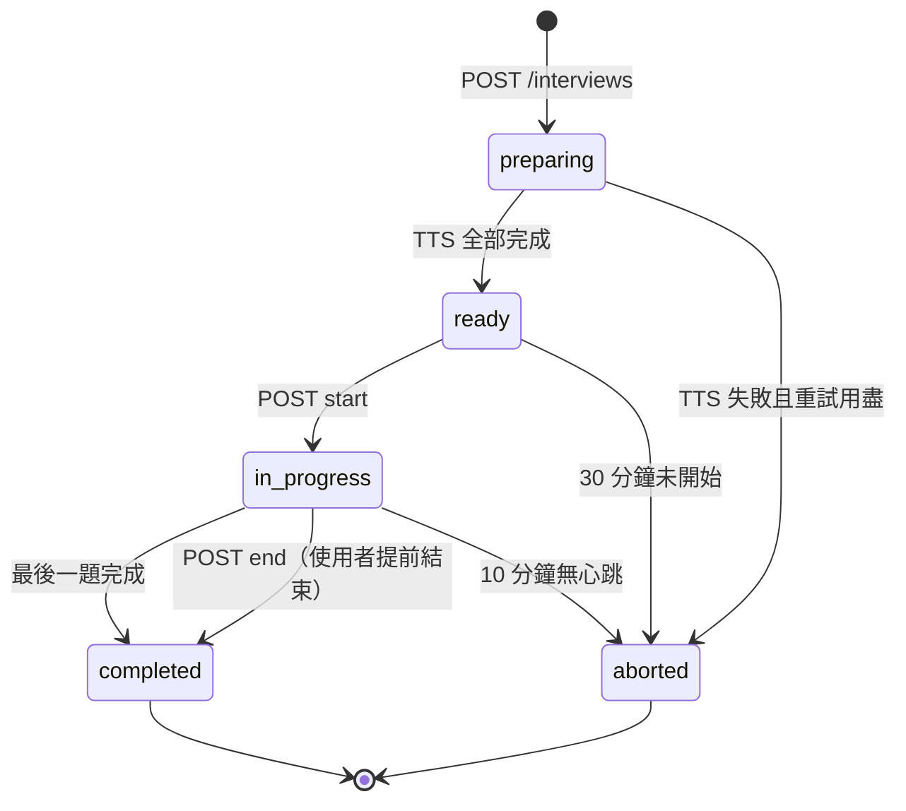
```mermaid
stateDiagram-v2
    [*] --> preparing: POST /interviews
    preparing --> ready: TTS 全部完成
    preparing --> aborted: TTS 失敗且重試用盡
    ready --> in_progress: POST start
    ready --> aborted: 30 分鐘未開始
    in_progress --> completed: 最後一題完成
    in_progress --> completed: POST end（使用者提前結束）
    in_progress --> aborted: 10 分鐘無心跳
    completed --> [*]
    aborted --> [*]
```

### 13.2 題目階段（`phase`）

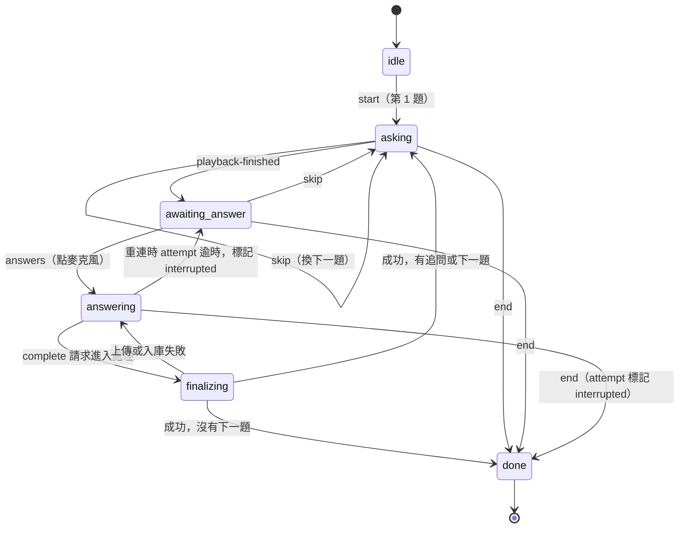
```mermaid
stateDiagram-v2
    [*] --> idle
    idle --> asking: start（第 1 題）
    asking --> awaiting_answer: playback-finished
    asking --> asking: skip（換下一題）
    awaiting_answer --> answering: answers（點麥克風）
    awaiting_answer --> asking: skip
    answering --> finalizing: complete 請求進入處理
    finalizing --> answering: 上傳或入庫失敗
    finalizing --> asking: 成功，有追問或下一題
    finalizing --> done: 成功，沒有下一題
    answering --> awaiting_answer: 重連時 attempt 逾時，標記 interrupted
    asking --> done: end
    awaiting_answer --> done: end
    answering --> done: end（attempt 標記 interrupted）
    done --> [*]
```

### 13.3 作答紀錄（`answer_attempts.status`）

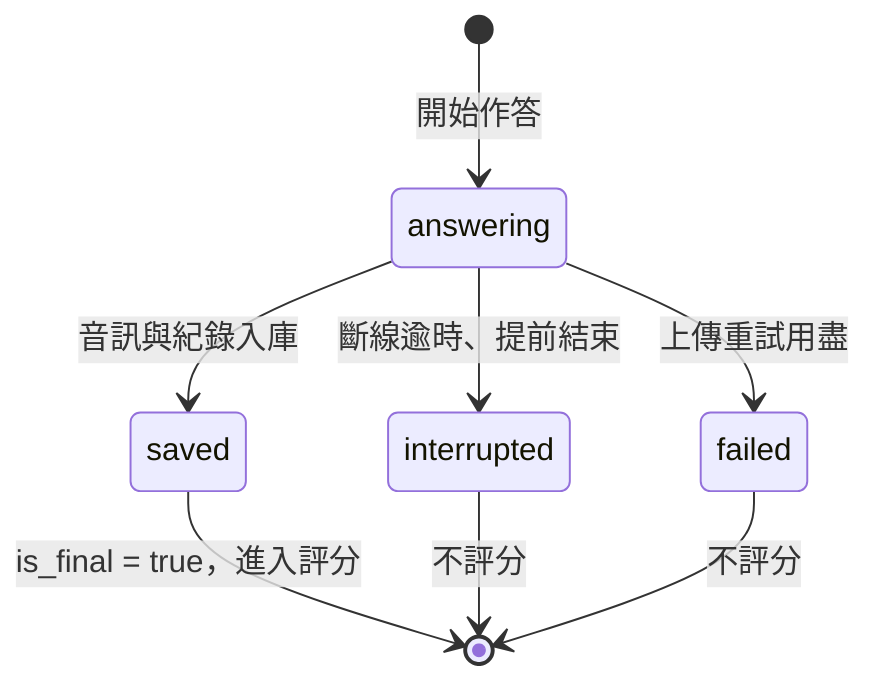
```mermaid
stateDiagram-v2
    [*] --> answering: 開始作答
    answering --> saved: 音訊與紀錄入庫
    answering --> interrupted: 斷線逾時、提前結束
    answering --> failed: 上傳重試用盡
    saved --> [*]: is_final = true，進入評分
    interrupted --> [*]: 不評分
    failed --> [*]: 不評分
```

## 14. 前端音訊與麥克風閘門

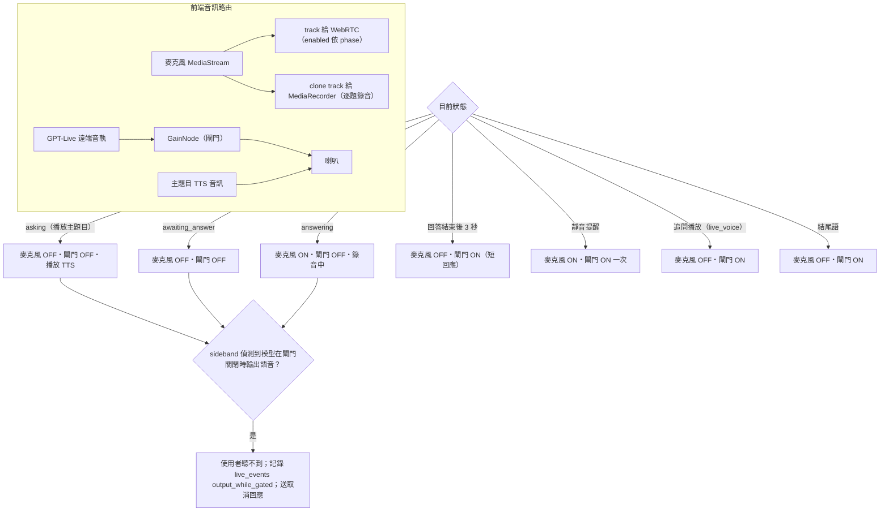
```mermaid
flowchart TD
    subgraph 前端音訊路由
        MIC["麥克風 MediaStream"] --> T1["track 給 WebRTC（enabled 依 phase）"]
        MIC --> T2["clone track 給 MediaRecorder（逐題錄音）"]
        REMOTE["GPT-Live 遠端音軌"] --> GAIN["GainNode（閘門）"] --> SPK["喇叭"]
        TTS["主題目 TTS 音訊"] --> SPK
    end

    P{"目前狀態"}
    P -->|"asking（播放主題目）"| S1["麥克風 OFF・閘門 OFF・播放 TTS"]
    P -->|"awaiting_answer"| S2["麥克風 OFF・閘門 OFF"]
    P -->|"answering"| S3["麥克風 ON・閘門 OFF・錄音中"]
    P -->|"回答結束後 3 秒"| S4["麥克風 OFF・閘門 ON（短回應）"]
    P -->|"靜音提醒"| S5["麥克風 ON・閘門 ON 一次"]
    P -->|"追問播放（live_voice）"| S6["麥克風 OFF・閘門 ON"]
    P -->|"結尾語"| S7["麥克風 OFF・閘門 ON"]

    S1 & S2 & S3 --> X{"sideband 偵測到模型在閘門關閉時輸出語音？"}
    X -- 是 --> Y["使用者聽不到；記錄 live_events output_while_gated；送取消回應"]
```

## 15. 追問決策

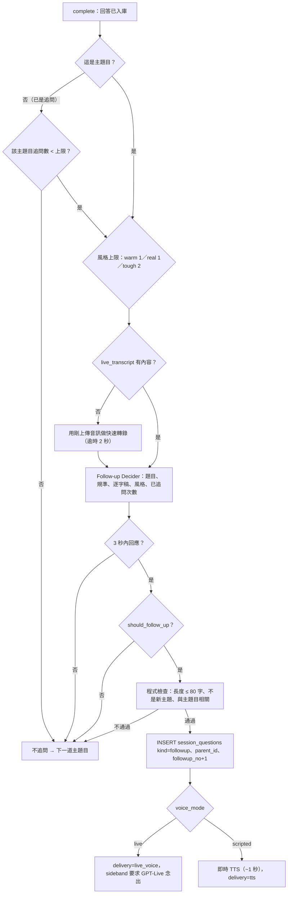
```mermaid
flowchart TD
    A["complete：回答已入庫"] --> B{"這是主題目？"}
    B -- 否（已是追問） --> B1{"該主題目追問數 < 上限？"}
    B -- 是 --> C
    B1 -- 否 --> Z["不追問 → 下一道主題目"]
    B1 -- 是 --> C{"風格上限：warm 1／real 1／tough 2"}
    C --> D{"live_transcript 有內容？"}
    D -- 否 --> D1["用剛上傳音訊做快速轉錄（逾時 2 秒）"]
    D1 --> E
    D -- 是 --> E["Follow-up Decider：題目、規準、逐字稿、風格、已追問次數"]
    E --> F{"3 秒內回應？"}
    F -- 否 --> Z
    F -- 是 --> G{"should_follow_up？"}
    G -- 否 --> Z
    G -- 是 --> H["程式檢查：長度 ≤ 80 字、不是新主題、與主題目相關"]
    H -- 不通過 --> Z
    H -- 通過 --> I["INSERT session_questions kind=followup、parent_id、followup_no+1"]
    I --> J{"voice_mode"}
    J -- live --> K["delivery=live_voice，sideband 要求 GPT-Live 念出"]
    J -- scripted --> L["即時 TTS（~1 秒），delivery=tts"]
```

## 16. 回答上傳失敗與重試

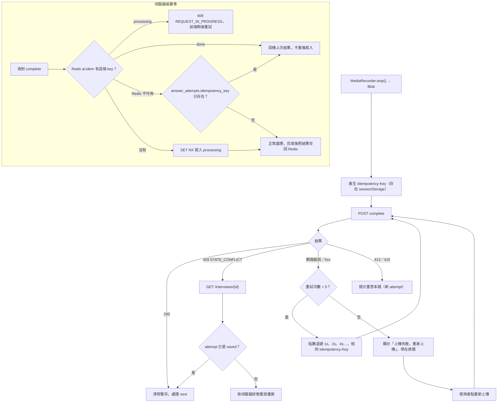
```mermaid
flowchart TD
    A["MediaRecorder.stop() → Blob"] --> B["產生 Idempotency-Key（存在 sessionStorage）"]
    B --> C["POST complete"]
    C --> D{"結果"}
    D -- 200 --> E["清除暫存，處理 next"]
    D -->|"409 STATE_CONFLICT"| F["GET /interviews/{id}"]
    F --> F1{"attempt 已是 saved？"}
    F1 -- 是 --> E
    F1 -- 否 --> G["依伺服器狀態重設畫面"]
    D -->|"網路錯誤／5xx"| H{"重試次數 < 5？"}
    H -- 是 --> I["指數退避 1s、2s、4s…，相同 Idempotency-Key"] --> C
    H -- 否 --> J["顯示「上傳失敗，重新上傳」，停在原題"]
    J --> K["使用者點重新上傳"] --> C
    D -->|"413／415"| L["提示重答本題（新 attempt）"]

    subgraph 伺服器端冪等
        S1["收到 complete"] --> S2{"Redis ai:idem 有這個 key？"}
        S2 -->|"done"| S3["回傳上次結果，不重複寫入"]
        S2 -->|"processing"| S5["409 REQUEST_IN_PROGRESS，前端稍後重試"]
        S2 -->|"沒有"| S6["SET NX 寫入 processing"]
        S2 -->|"Redis 不可用"| S7{"answer_attempts.idempotency_key 已存在？"}
        S7 -- 是 --> S3
        S7 -- 否 --> S4
        S6 --> S4["正常處理，完成後把結果存回 Redis"]
    end
```

## 17. 斷線重連與降級

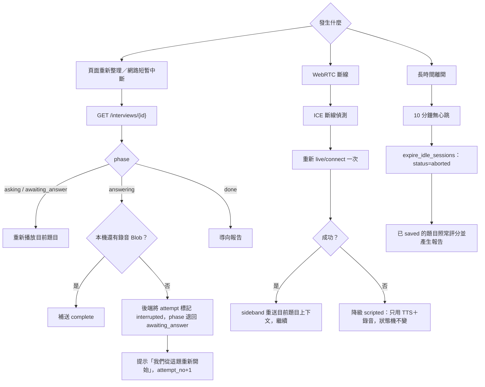
```mermaid
flowchart TD
    A{"發生什麼"} --> B["頁面重新整理／網路短暫中斷"]
    A --> C["WebRTC 斷線"]
    A --> D["長時間離開"]

    B --> B1["GET /interviews/{id}"]
    B1 --> B2{"phase"}
    B2 -->|"asking / awaiting_answer"| B3["重新播放目前題目"]
    B2 -- answering --> B4{"本機還有錄音 Blob？"}
    B4 -- 是 --> B5["補送 complete"]
    B4 -- 否 --> B6["後端將 attempt 標記 interrupted，phase 退回 awaiting_answer"]
    B6 --> B7["提示「我們從這題重新開始」，attempt_no+1"]
    B2 -- done --> B8["導向報告"]

    C --> C1["ICE 斷線偵測"]
    C1 --> C2["重新 live/connect 一次"]
    C2 --> C3{"成功？"}
    C3 -- 是 --> C4["sideband 重送目前題目上下文，繼續"]
    C3 -- 否 --> C5["降級 scripted：只用 TTS＋錄音，狀態機不變"]

    D --> D1["10 分鐘無心跳"]
    D1 --> D2["expire_idle_sessions：status=aborted"]
    D2 --> D3["已 saved 的題目照常評分並產生報告"]
```

## 18. 跳過題目與提前結束

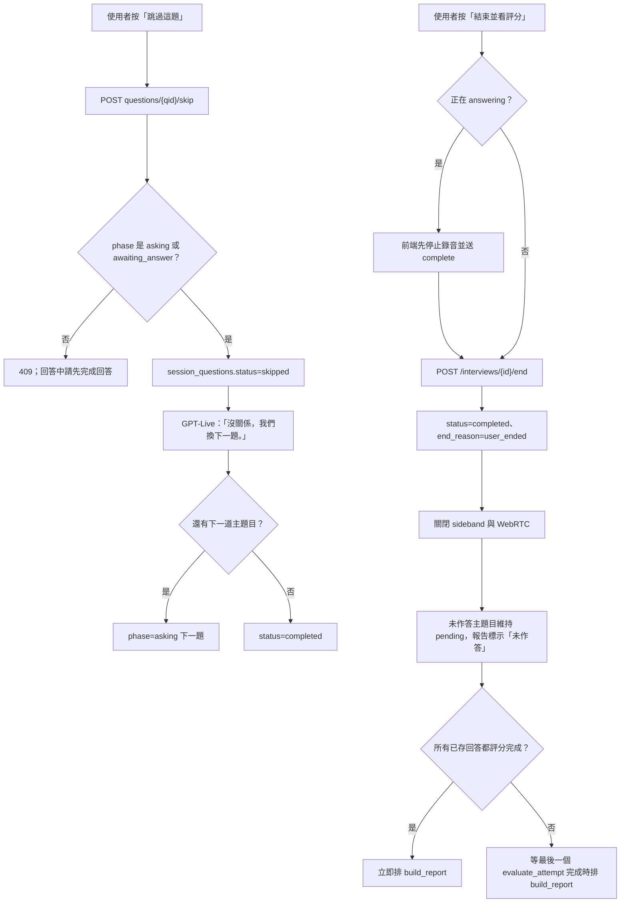
```mermaid
flowchart TD
    A["使用者按「跳過這題」"] --> B["POST questions/{qid}/skip"]
    B --> C{"phase 是 asking 或 awaiting_answer？"}
    C -- 否 --> C1["409；回答中請先完成回答"]
    C -- 是 --> D["session_questions.status=skipped"]
    D --> E["GPT-Live：「沒關係，我們換下一題。」"]
    E --> F{"還有下一道主題目？"}
    F -- 是 --> G["phase=asking 下一題"]
    F -- 否 --> H["status=completed"]

    X["使用者按「結束並看評分」"] --> Y{"正在 answering？"}
    Y -- 是 --> Y1["前端先停止錄音並送 complete"]
    Y1 --> Z["POST /interviews/{id}/end"]
    Y -- 否 --> Z
    Z --> Z1["status=completed、end_reason=user_ended"]
    Z1 --> Z2["關閉 sideband 與 WebRTC"]
    Z2 --> Z3["未作答主題目維持 pending，報告標示「未作答」"]
    Z3 --> Z4{"所有已存回答都評分完成？"}
    Z4 -- 是 --> Z5["立即排 build_report"]
    Z4 -- 否 --> Z6["等最後一個 evaluate_attempt 完成時排 build_report"]
```

## 19. 評分管線（轉錄 → 逐題評分 → 報告）

```mermaid
flowchart TD
    A["complete 成功"] --> B["transcribe_attempt（優先序 10）"]
    B --> C["從物件儲存下載該題音訊"]
    C --> D["STT 檔案轉錄（含時間段）"]
    D --> E{"品質檢查"}
    E -->|"無聲音／字數 < 10"| E1["transcript_status=low_quality"]
    E -- 正常 --> E2["final_transcript、transcript_segments"]
    E1 --> F
    E2 --> F["evaluate_attempt"]

    F --> G{"transcript_status"}
    G -- low_quality --> G1["evaluations.status=needs_review，review_reason=回答過短或聽不清楚"]
    G -- done --> H["組裝輸入：題目、評分規準、預期要點、職缺摘要、相關履歷背景、完整逐字稿、追問與回答"]
    H --> I["Answer Evaluator（Structured Outputs，temperature 低）"]
    I --> J["程式驗證"]

    subgraph 程式驗證
        J1["分數 0–100、五維度齊全"]
        J2["evidence 每句都必須出現在逐字稿中，否則剔除"]
        J3["highlight 必須是逐字稿子字串，否則改用第一條 evidence"]
        J4["strengths ≤ 3、improvements ≤ 4"]
    end
    J --> J1 --> J2 --> J3 --> J4

    J4 --> K["程式計算：贅詞次數、語速"]
    K --> L["INSERT evaluations status=done"]
    G1 --> M
    L --> M{"場次已結束 且 所有 final attempt 都評分完成？"}
    M -- 否 --> M1["等待"]
    M -- 是 --> N["build_report（dedupe_key＋Redis 鎖 ai:lock:report:{session_id}）"]
    N --> O["程式計算總分、五維度平均、平均作答時間、與上次差距"]
    O --> P["Report Aggregator：總結評語、下次練習重點"]
    P --> Q["interview_reports status=ready"]
    L --> L1["PUBLISH ai:evt:report:{session_id} evaluation_done"]
    Q --> R["PUBLISH report_ready；清除 ai:cache:dash:{user_id}"]
    R --> R1["持有 SSE 的 API 實例轉送給前端"]
```

## 20. 查看報告與加入題庫

```mermaid
sequenceDiagram
    autonumber
    actor U as 使用者
    participant FE as 前端（面試評分）
    participant API as FastAPI
    participant DB as PostgreSQL
    participant RD as Redis
    participant W as Worker
    participant OBJ as 物件儲存

    FE->>API: GET /interviews/{id}/report
    alt status = processing
        API-->>FE: 已完成題目＋其餘骨架
        FE->>API: GET /report/events（SSE）
        API->>RD: SUBSCRIBE ai:evt:report:{session_id}
        API-->>FE: event snapshot（目前進度）
        W->>RD: PUBLISH evaluation_done × N
        RD-->>API: 訊息
        API-->>FE: evaluation_done × N
        W->>RD: PUBLISH report_ready
        API-->>FE: report_ready
        FE->>API: GET /interviews/{id}/report
    end
    API->>DB: reports、session_questions、final attempts、evaluations
    API-->>FE: 總分、五維度、指標、逐題回顧
    FE->>U: 顯示總分環、逐題卡片（逐字稿標示 highlight）
    U->>FE: 播放某題錄音
    FE->>API: GET /answers/{aid}/audio
    API->>OBJ: 產生 5 分鐘預簽名 URL
    API-->>FE: url
    U->>FE: 「加入題庫複習」
    FE->>API: POST /report/add-to-set
    API->>DB: 分數 < 80 的題目複製到題組（source=report，去重）
    API-->>FE: added
    U->>FE: 「再練一次」
    FE->>FE: 帶相同職缺與題組前往面試頁
```

## 21. 首頁 Dashboard

```mermaid
flowchart LR
    A0["GET /dashboard"] --> A1{"Redis ai:cache:dash:{user_id} 命中？"}
    A1 -- 是 --> Z["直接回傳（TTL 60 秒）"]
    A1 -- 否 --> A["查詢 PostgreSQL"]
    A --> B["最近一份報告 → 上次分數、最弱題型"]
    A --> C["最近 8 份報告 → 趨勢圖"]
    A --> D["近 60 天完成場次日期 → 連續天數、本週打卡"]
    A --> E["最近 4 場面試 → 最近的面試列表"]
    A --> F["最弱維度 → 內建提示庫 → 今日小提醒"]
    A --> G["job_matches 主要履歷前 3 名 → 推薦職缺"]
    B & C & D & E & F & G --> H["組成單一 JSON 回應"]
    H --> H1["寫入 Redis 快取"]
```

## 22. 背景工作生命週期

佇列在 Redis（arq），PostgreSQL `background_jobs` 是 outbox 與執行紀錄。完整投遞時序見 [architecture.md §4.3.3](architecture.md)。

```mermaid
stateDiagram-v2
    [*] --> queued: INSERT（與業務資料同一交易）
    queued --> queued: COMMIT 後投遞 arq，寫 dispatched_at
    queued --> running: Worker 取得，條件更新成功
    running --> succeeded: handler 成功
    running --> retrying: 失敗且 attempts < max，arq Retry 指數退避
    retrying --> running: 重試時間到
    running --> dead: 失敗且 attempts ≥ max
    running --> retrying: started_at 超過 10 分鐘（卡住回收）
    succeeded --> [*]
    dead --> [*]: 告警，人工處理
```

```mermaid
flowchart LR
    subgraph PG["PostgreSQL"]
        OB[("background_jobs outbox")]
    end
    subgraph RD["Redis"]
        QI["arq:queue:interactive"]
        QD["arq:queue:default"]
    end
    API["FastAPI"] -->|"交易內寫入"| OB
    API -->|"COMMIT 後投遞"| QI & QD
    SW["sweep_outbox 每 30 秒"] -->|"未投遞或遺失"| OB
    SW -->|"重新投遞（相同 _job_id）"| QI & QD
    QI --> WI["interactive worker：TTS、轉錄"]
    QD --> WD["default worker：解析、生成、評分、報告、排程"]
    WI & WD -->|"更新狀態"| OB
```

```mermaid
flowchart LR
    R["parse_resume"] --> M["compute_matches"]
    J["parse_job"] --> M
    TQ["synthesize_tts"] --> RDY["場次 ready"]
    T["transcribe_attempt"] --> EV["evaluate_attempt"]
    EV --> RP["build_report（全部完成時）"]
    Q["generate_questions"]
    P["generate_prep"]
    BR["build_rubric"]
    CRON["arq cron：sweep_outbox／flush_live_events／expire_idle_sessions／purge_expired_audio／maintain_partitions"]
```

## 23. AI 呼叫與 Log 記錄

```mermaid
sequenceDiagram
    autonumber
    participant SVC as 任一 Agent / Worker
    participant LC as LLMClient
    participant AI as OpenAI
    participant DB as PostgreSQL
    participant LOG as stdout / Sentry

    SVC->>LC: call(purpose, model, prompt_version, schema, user_id, session_id)
    LC->>LC: 記錄開始時間、request_id
    LC->>AI: 請求（逾時、最多重試 2 次）
    alt 成功
        AI-->>LC: 結果＋用量
        LC->>LC: 依 Structured Outputs schema 解析
        LC->>DB: INSERT llm_calls（tokens、audio_seconds、cost_usd、latency_ms、status=ok）
        LC-->>SVC: 已驗證的物件
    else 失敗或逾時
        LC->>DB: INSERT llm_calls（status=error/timeout、error_code）
        LC->>LOG: 結構化錯誤 log＋Sentry
        LC-->>SVC: 拋出 UpstreamError（由工作重試機制處理）
    end
```

## 24. 使用者完整旅程

```mermaid
flowchart TD
    A["註冊／登入"] --> B["上傳履歷 → AI 解析"]
    B --> C{"要練哪個職缺？"}
    C -- 平台職缺 --> D["職缺找尋：看契合度"]
    C -- 自己的目標職缺 --> E["貼上 JD → AI 解析"]
    D --> F["面試建議：優勢、補強、可能題目"]
    E --> F
    F --> G["題目生成與編輯：依履歷＋職缺出題，可修改排序"]
    G --> H["AI 語音面試：系統逐題播放、使用者回答、逐題錄音入庫"]
    H --> I["背景：逐題轉錄 → 逐題評分 → 報告"]
    I --> J["面試評分：逐題原題、逐字稿、做得好、改善建議、可以這樣說"]
    J --> K{"下一步"}
    K -- 弱項題加入題庫 --> G
    K -- 再練一次 --> H
    K -- 換職缺 --> C
    J --> L["首頁：分數趨勢、連續練習、下次提醒"]
```
