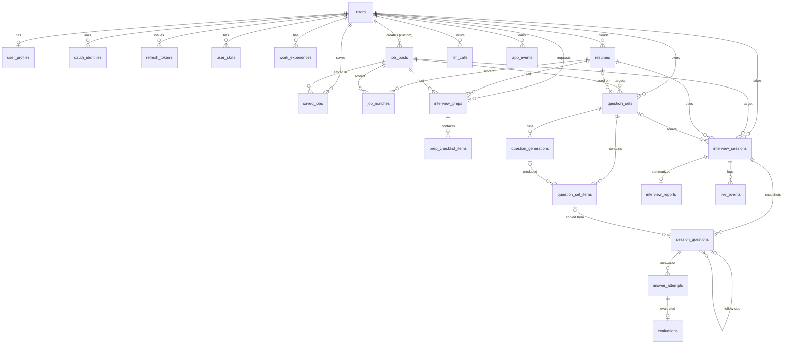
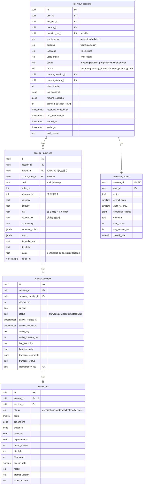
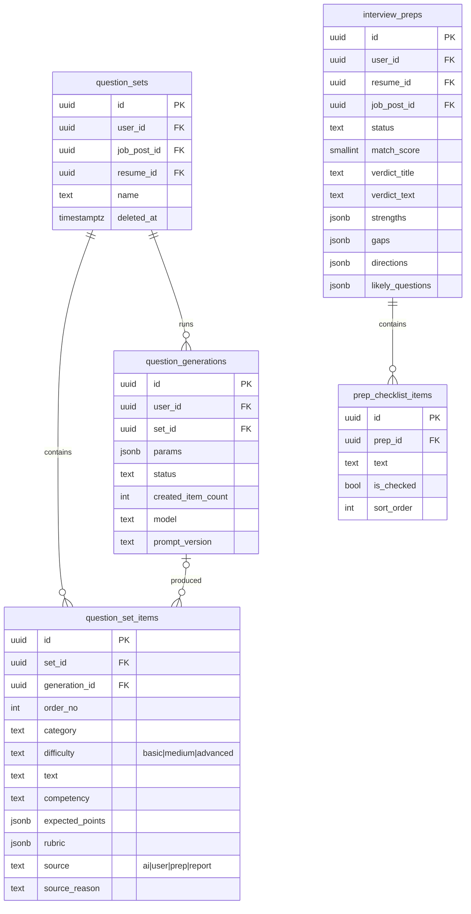
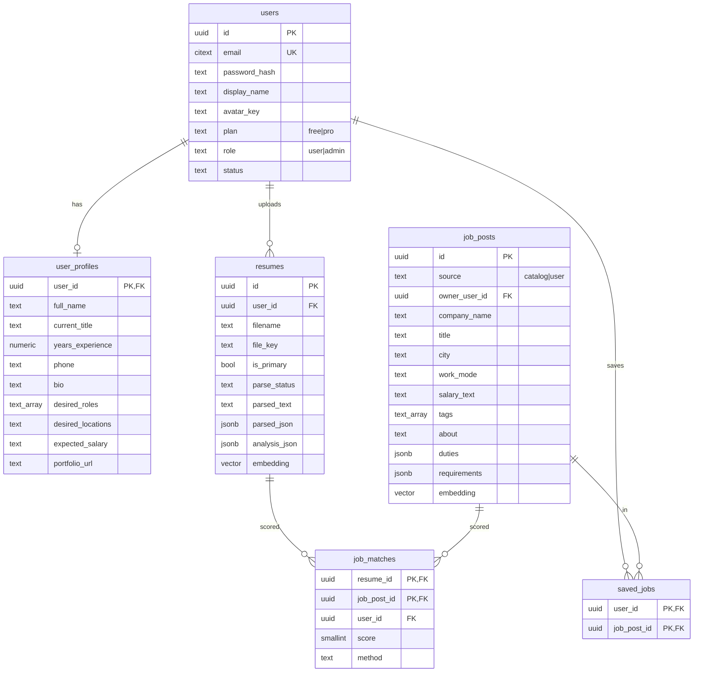

# AI Interview — PostgreSQL 資料庫規格書

> 版本：v0.1・資料庫：PostgreSQL 16＋`pgvector`、`pg_trgm`、`citext`
> 相關文件：[architecture.md](architecture.md)・[api.md](api.md)・[flows.md](flows.md)

---

## 1. 設計原則

1. **快照優先**：面試開始時，把職缺、履歷、題目**複製**進場次（`job_snapshot`、`resume_snapshot`、`session_questions`）。使用者日後修改，舊報告不變。
2. **可編輯的草稿與凍結的紀錄分開**：`question_set_items` 是可編輯的題庫；`session_questions` 是某場面試**實際播放的題目**，建立後不可修改。
3. **狀態推進用樂觀鎖**：`interview_sessions.state_version` 每次推進 +1，更新時必須帶上預期版本。
4. **冪等**：回答上傳、背景工作都帶冪等鍵（`idempotency_key`、`dedupe_key`）。API 層的通用冪等快取放 Redis，但**回答上傳**另有資料庫唯一約束兜底。
10. **PostgreSQL 是唯一真實來源**：Redis（佇列、快取、鎖、即時字幕緩衝）裡的資料都必須能從 PostgreSQL 重建或可以遺失，見 [architecture.md §4.3](architecture.md)。
5. **列舉值用 `text + CHECK`**，不用 PostgreSQL `ENUM`（新增值不必改型別，Alembic 遷移較單純）。
6. **主鍵**：業務表用 `uuid`（`gen_random_uuid()`）；Log 類大表用 `bigint identity`，並按月分區。
7. **時間**一律 `timestamptz`，儲存 UTC。
8. **AI 結構化輸出**存 `jsonb`，但**查詢與排序會用到的欄位**（分數、狀態）獨立成一般欄位。
9. **軟刪除**只用在使用者可見、可能需要復原的內容（履歷、職缺、題目）；個資刪除請求一律硬刪除。

---

## 2. ER 圖

### 2.1 全貌



### 2.2 核心：面試與評分（含欄位）



### 2.3 題庫與面試建議（含欄位）



### 2.4 使用者、履歷與職缺（含欄位）



---

## 3. 資料表清單

| 領域 | 資料表 | 說明 | 對應 UI |
|---|---|---|---|
| 帳號 | `users` | 帳號、方案、狀態 | 登入 |
| | `oauth_identities` | Google 等第三方登入 | 登入 |
| | `refresh_tokens` | Refresh token 雜湊、輪替 | — |
| 個人檔案 | `user_profiles` | 基本資料、求職意向 | 個人檔案 |
| | `user_skills` | 技能標籤 | 個人檔案・技能 |
| | `work_experiences` | 工作與學歷 | 個人檔案・工作經歷 |
| | `resumes` | 履歷原檔位置、解析結果、AI 建議、embedding | 個人檔案・履歷 |
| 職缺 | `job_posts` | 平台職缺與使用者自訂職缺 | 職缺找尋 |
| | `saved_jobs` | 收藏 | 職缺・收藏 |
| | `job_matches` | 履歷×職缺契合度快取 | 職缺・契合度 |
| 準備 | `interview_preps` | 面試建議分析結果 | 面試建議 |
| | `prep_checklist_items` | 準備清單勾選狀態 | 面試建議・清單 |
| 題庫 | `question_sets` | 題組（每使用者×職缺可多組） | 題目生成與編輯 |
| | `question_set_items` | 題組中的題目（可編輯、排序） | 題目卡片 |
| | `question_generations` | 一次 AI 生成工作與參數 | 生成題目 |
| 面試 | `interview_sessions` | 一場面試、狀態機 | AI 語音面試 |
| | `session_questions` | 該場**實際使用**的主題目與追問（快照） | 進度、題目 |
| | `answer_attempts` | 每次作答：音訊、即時與最終逐字稿 | 逐字稿 |
| 評分 | `evaluations` | 逐題評分與建議 | 逐題回顧 |
| | `interview_reports` | 整場報告 | 面試評分 |
| 系統 | `background_jobs` | 背景工作 outbox 與執行紀錄（實際佇列在 Redis／arq） | — |
| Log | `llm_calls` | AI 呼叫與成本（月分區） | — |
| | `live_events` | GPT‑Live sideband 事件（月分區） | — |
| | `app_events` | 產品事件與稽核（月分區） | — |

---

## 4. DDL

### 4.1 擴充與共用

```sql
CREATE EXTENSION IF NOT EXISTS citext;
CREATE EXTENSION IF NOT EXISTS pg_trgm;
CREATE EXTENSION IF NOT EXISTS vector;     -- pgvector
-- gen_random_uuid() 自 PostgreSQL 13 起內建

CREATE OR REPLACE FUNCTION set_updated_at() RETURNS trigger AS $$
BEGIN NEW.updated_at = now(); RETURN NEW; END $$ LANGUAGE plpgsql;
-- 每張含 updated_at 的表都掛：
-- CREATE TRIGGER trg_<table>_updated BEFORE UPDATE ON <table> FOR EACH ROW EXECUTE FUNCTION set_updated_at();
```

### 4.2 帳號與個人檔案

```sql
CREATE TABLE users (
  id                 uuid PRIMARY KEY DEFAULT gen_random_uuid(),
  email              citext NOT NULL UNIQUE,
  password_hash      text,                                   -- 僅 OAuth 登入者為 NULL
  display_name       text NOT NULL,
  avatar_key         text,
  plan               text NOT NULL DEFAULT 'free' CHECK (plan IN ('free','pro')),
  role               text NOT NULL DEFAULT 'user' CHECK (role IN ('user','admin')),
  status             text NOT NULL DEFAULT 'active' CHECK (status IN ('active','suspended','deleted')),
  locale             text NOT NULL DEFAULT 'zh-TW',
  email_verified_at  timestamptz,
  last_login_at      timestamptz,
  created_at         timestamptz NOT NULL DEFAULT now(),
  updated_at         timestamptz NOT NULL DEFAULT now()
);

CREATE TABLE oauth_identities (
  id                uuid PRIMARY KEY DEFAULT gen_random_uuid(),
  user_id           uuid NOT NULL REFERENCES users(id) ON DELETE CASCADE,
  provider          text NOT NULL CHECK (provider IN ('google')),
  provider_user_id  text NOT NULL,
  created_at        timestamptz NOT NULL DEFAULT now(),
  UNIQUE (provider, provider_user_id)
);

CREATE TABLE refresh_tokens (
  id          uuid PRIMARY KEY DEFAULT gen_random_uuid(),
  user_id     uuid NOT NULL REFERENCES users(id) ON DELETE CASCADE,
  family_id   uuid NOT NULL,                 -- 同一登入鏈；偵測到重放時整個 family 撤銷
  token_hash  text NOT NULL UNIQUE,          -- SHA-256，不存明文
  expires_at  timestamptz NOT NULL,
  revoked_at  timestamptz,
  user_agent  text,
  ip          inet,
  created_at  timestamptz NOT NULL DEFAULT now()
);
CREATE INDEX ix_refresh_tokens_user ON refresh_tokens(user_id) WHERE revoked_at IS NULL;

CREATE TABLE user_profiles (
  user_id            uuid PRIMARY KEY REFERENCES users(id) ON DELETE CASCADE,
  full_name          text,
  current_title      text,
  years_experience   numeric(3,1),
  phone              text,
  bio                text,
  desired_roles      text[] NOT NULL DEFAULT '{}',
  desired_locations  text,
  expected_salary    text,                   -- 自由輸入，例如「80,000 – 90,000」
  portfolio_url      text,
  updated_at         timestamptz NOT NULL DEFAULT now()
);

CREATE TABLE user_skills (
  id          uuid PRIMARY KEY DEFAULT gen_random_uuid(),
  user_id     uuid NOT NULL REFERENCES users(id) ON DELETE CASCADE,
  name        text NOT NULL CHECK (length(name) BETWEEN 1 AND 40),
  sort_order  int  NOT NULL DEFAULT 0,
  created_at  timestamptz NOT NULL DEFAULT now()
);
CREATE UNIQUE INDEX uq_user_skills_name ON user_skills(user_id, lower(name));

CREATE TABLE work_experiences (
  id            uuid PRIMARY KEY DEFAULT gen_random_uuid(),
  user_id       uuid NOT NULL REFERENCES users(id) ON DELETE CASCADE,
  kind          text NOT NULL CHECK (kind IN ('work','education')),
  organization  text NOT NULL,
  title         text NOT NULL,
  start_date    date,
  end_date      date,                        -- NULL 且 is_current=true 表示「現在」
  is_current    boolean NOT NULL DEFAULT false,
  description   text,
  sort_order    int NOT NULL DEFAULT 0,
  created_at    timestamptz NOT NULL DEFAULT now(),
  updated_at    timestamptz NOT NULL DEFAULT now()
);
CREATE INDEX ix_work_experiences_user ON work_experiences(user_id, sort_order);
```

### 4.3 履歷

```sql
CREATE TABLE resumes (
  id             uuid PRIMARY KEY DEFAULT gen_random_uuid(),
  user_id        uuid NOT NULL REFERENCES users(id) ON DELETE CASCADE,
  filename       text NOT NULL,
  mime_type      text NOT NULL,
  size_bytes     int  NOT NULL CHECK (size_bytes <= 10 * 1024 * 1024),
  file_key       text NOT NULL,              -- users/{user_id}/resumes/{id}.pdf
  sha256         text NOT NULL,
  is_primary     boolean NOT NULL DEFAULT false,
  parse_status   text NOT NULL DEFAULT 'pending'
                 CHECK (parse_status IN ('pending','parsing','parsed','failed')),
  parsed_text    text,
  parsed_json    jsonb,                      -- 基本資料、經歷、技能、專案、量化成果
  analysis_json  jsonb,                      -- {highlights:[], improvements:[]}
  embedding      vector(1536),               -- 維度依 EMBEDDING_MODEL 調整
  parse_error    text,
  created_at     timestamptz NOT NULL DEFAULT now(),
  updated_at     timestamptz NOT NULL DEFAULT now(),
  deleted_at     timestamptz
);
CREATE INDEX ix_resumes_user ON resumes(user_id, created_at DESC) WHERE deleted_at IS NULL;
CREATE UNIQUE INDEX uq_resumes_primary ON resumes(user_id) WHERE is_primary AND deleted_at IS NULL;
```

### 4.4 職缺

```sql
CREATE TABLE job_posts (
  id               uuid PRIMARY KEY DEFAULT gen_random_uuid(),
  source           text NOT NULL CHECK (source IN ('catalog','user')),
  owner_user_id    uuid REFERENCES users(id) ON DELETE CASCADE,
  external_ref     text,                     -- 匯入來源的 ID
  company_name     text NOT NULL,
  company_logo_key text,
  title            text NOT NULL,
  city             text,                     -- 台北市、新竹市…（篩選用）
  location_text    text,                     -- 台北市信義區
  employment_type  text,                     -- 全職、兼職…
  work_mode        text CHECK (work_mode IN ('onsite','hybrid','remote')),
  work_mode_note   text,                     -- 每週 2 天遠端
  salary_text      text,
  salary_min       int,
  salary_max       int,
  salary_period    text CHECK (salary_period IN ('month','year')),
  tags             text[] NOT NULL DEFAULT '{}',
  about            text,
  duties           jsonb NOT NULL DEFAULT '[]',
  requirements     jsonb NOT NULL DEFAULT '[]',
  work_language    text,                     -- zh / en
  is_foreign       boolean NOT NULL DEFAULT false,
  raw_text         text,                     -- 使用者貼上的原始 JD
  parse_status     text NOT NULL DEFAULT 'parsed'
                   CHECK (parse_status IN ('pending','parsing','parsed','failed')),
  search_text      text NOT NULL DEFAULT '', -- 職稱+公司+標籤，應用程式維護
  embedding        vector(1536),
  status           text NOT NULL DEFAULT 'active' CHECK (status IN ('draft','active','closed')),
  posted_at        timestamptz,
  created_at       timestamptz NOT NULL DEFAULT now(),
  updated_at       timestamptz NOT NULL DEFAULT now(),
  deleted_at       timestamptz,
  CHECK ((source = 'user') = (owner_user_id IS NOT NULL))
);
CREATE INDEX ix_job_posts_catalog ON job_posts(status, posted_at DESC) WHERE source = 'catalog' AND deleted_at IS NULL;
CREATE INDEX ix_job_posts_owner   ON job_posts(owner_user_id, created_at DESC) WHERE source = 'user' AND deleted_at IS NULL;
CREATE INDEX ix_job_posts_city    ON job_posts(city);
CREATE INDEX ix_job_posts_search  ON job_posts USING gin (search_text gin_trgm_ops);
CREATE INDEX ix_job_posts_tags    ON job_posts USING gin (tags);
CREATE INDEX ix_job_posts_emb     ON job_posts USING hnsw (embedding vector_cosine_ops);

CREATE TABLE saved_jobs (
  user_id      uuid NOT NULL REFERENCES users(id) ON DELETE CASCADE,
  job_post_id  uuid NOT NULL REFERENCES job_posts(id) ON DELETE CASCADE,
  created_at   timestamptz NOT NULL DEFAULT now(),
  PRIMARY KEY (user_id, job_post_id)
);

CREATE TABLE job_matches (
  resume_id    uuid NOT NULL REFERENCES resumes(id) ON DELETE CASCADE,
  job_post_id  uuid NOT NULL REFERENCES job_posts(id) ON DELETE CASCADE,
  user_id      uuid NOT NULL REFERENCES users(id) ON DELETE CASCADE,
  score        smallint NOT NULL CHECK (score BETWEEN 0 AND 100),
  method       text NOT NULL CHECK (method IN ('embedding','llm')),
  rationale    jsonb,
  computed_at  timestamptz NOT NULL DEFAULT now(),
  PRIMARY KEY (resume_id, job_post_id)
);
CREATE INDEX ix_job_matches_rank ON job_matches(resume_id, score DESC);
```

### 4.5 面試建議

```sql
CREATE TABLE interview_preps (
  id                uuid PRIMARY KEY DEFAULT gen_random_uuid(),
  user_id           uuid NOT NULL REFERENCES users(id) ON DELETE CASCADE,
  resume_id         uuid NOT NULL REFERENCES resumes(id),
  job_post_id       uuid NOT NULL REFERENCES job_posts(id),
  status            text NOT NULL DEFAULT 'pending'
                    CHECK (status IN ('pending','running','ready','failed')),
  match_score       smallint CHECK (match_score BETWEEN 0 AND 100),
  verdict_title     text,                    -- 整體很適合你
  verdict_text      text,
  strengths         jsonb,                   -- ["3 年 React 經驗…"]
  gaps              jsonb,                   -- ["履歷沒有寫到帶人…"]
  directions        jsonb,                   -- [{"label":"React 效能優化","probability":92}]
  likely_questions  jsonb,                   -- [{"question","why","tip","priority":"high|medium|low"}]
  model             text,
  prompt_version    text,
  error             text,
  created_at        timestamptz NOT NULL DEFAULT now(),
  updated_at        timestamptz NOT NULL DEFAULT now()
);
CREATE INDEX ix_preps_latest ON interview_preps(user_id, job_post_id, resume_id, created_at DESC);

CREATE TABLE prep_checklist_items (
  id          uuid PRIMARY KEY DEFAULT gen_random_uuid(),
  prep_id     uuid NOT NULL REFERENCES interview_preps(id) ON DELETE CASCADE,
  text        text NOT NULL,
  is_checked  boolean NOT NULL DEFAULT false,
  sort_order  int NOT NULL,
  updated_at  timestamptz NOT NULL DEFAULT now()
);
CREATE INDEX ix_prep_checklist ON prep_checklist_items(prep_id, sort_order);
```

### 4.6 題庫

```sql
CREATE TABLE question_sets (
  id           uuid PRIMARY KEY DEFAULT gen_random_uuid(),
  user_id      uuid NOT NULL REFERENCES users(id) ON DELETE CASCADE,
  job_post_id  uuid NOT NULL REFERENCES job_posts(id),
  resume_id    uuid REFERENCES resumes(id),
  name         text NOT NULL,
  created_at   timestamptz NOT NULL DEFAULT now(),
  updated_at   timestamptz NOT NULL DEFAULT now(),
  deleted_at   timestamptz
);
CREATE INDEX ix_question_sets_user_job ON question_sets(user_id, job_post_id) WHERE deleted_at IS NULL;

CREATE TABLE question_generations (
  id                  uuid PRIMARY KEY DEFAULT gen_random_uuid(),
  user_id             uuid NOT NULL REFERENCES users(id) ON DELETE CASCADE,
  set_id              uuid NOT NULL REFERENCES question_sets(id) ON DELETE CASCADE,
  params              jsonb NOT NULL,        -- {categories:[], difficulty, count, note}
  status              text NOT NULL DEFAULT 'pending'
                      CHECK (status IN ('pending','running','succeeded','failed')),
  created_item_count  int NOT NULL DEFAULT 0,
  model               text,
  prompt_version      text,
  error               text,
  created_at          timestamptz NOT NULL DEFAULT now(),
  finished_at         timestamptz
);

CREATE TABLE question_set_items (
  id               uuid PRIMARY KEY DEFAULT gen_random_uuid(),
  set_id           uuid NOT NULL REFERENCES question_sets(id) ON DELETE CASCADE,
  generation_id    uuid REFERENCES question_generations(id) ON DELETE SET NULL,
  order_no         int  NOT NULL,
  category         text NOT NULL,            -- 自我介紹、技術深度、系統設計、團隊合作、情境題、動機與規劃、自訂
  difficulty       text NOT NULL CHECK (difficulty IN ('basic','medium','advanced')),
  text             text NOT NULL CHECK (length(text) BETWEEN 1 AND 500),
  competency       text,                     -- 考察能力
  expected_points  jsonb NOT NULL DEFAULT '[]',
  rubric           jsonb,                    -- 評分規準，使用者自訂題目時由 AI 補
  source           text NOT NULL CHECK (source IN ('ai','user','prep','report')),
  source_reason    text,                     -- 為何針對此職缺／履歷出這題
  created_at       timestamptz NOT NULL DEFAULT now(),
  updated_at       timestamptz NOT NULL DEFAULT now(),
  deleted_at       timestamptz
);
-- 排序用可延遲唯一約束，交換順序時同一交易內不會撞號
ALTER TABLE question_set_items
  ADD CONSTRAINT uq_set_items_order UNIQUE (set_id, order_no) DEFERRABLE INITIALLY DEFERRED;
CREATE INDEX ix_set_items_text_trgm ON question_set_items USING gin (text gin_trgm_ops);
```

> 刪除題目時同時把 `order_no` 改成負數或重新排號，避免軟刪除的列佔住順序。實作上建議：刪除＝軟刪除＋同交易重排剩下題目。

### 4.7 面試（核心）

```sql
CREATE TABLE interview_sessions (
  id                      uuid PRIMARY KEY DEFAULT gen_random_uuid(),
  user_id                 uuid NOT NULL REFERENCES users(id) ON DELETE CASCADE,
  job_post_id             uuid NOT NULL REFERENCES job_posts(id),
  resume_id               uuid NOT NULL REFERENCES resumes(id),
  question_set_id         uuid REFERENCES question_sets(id) ON DELETE SET NULL,
  length_mode             text NOT NULL CHECK (length_mode IN ('quick','standard','deep')),
  persona                 text NOT NULL CHECK (persona IN ('warm','real','tough')),
  language                text NOT NULL CHECK (language IN ('zh','en','mixed')),
  voice_mode              text NOT NULL CHECK (voice_mode IN ('live','scripted')),
  voice_mode_degraded_at  timestamptz,       -- live 降級為 scripted 的時間
  status                  text NOT NULL DEFAULT 'preparing'
                          CHECK (status IN ('preparing','ready','in_progress','completed','aborted')),
  phase                   text NOT NULL DEFAULT 'idle'
                          CHECK (phase IN ('idle','asking','awaiting_answer','answering','finalizing','done')),
  current_question_id     uuid,              -- FK 於下方補上（循環參照）
  current_attempt_id      uuid,
  state_version           int  NOT NULL DEFAULT 0,
  job_snapshot            jsonb NOT NULL,
  resume_snapshot         jsonb NOT NULL,    -- 只放出題與評分需要的結構化欄位
  planned_question_count  smallint NOT NULL,
  live_provider           text,
  live_session_ref        text,              -- 供 sideband 連線用的對話 ID
  recording_consent_at    timestamptz,
  last_heartbeat_at       timestamptz,
  started_at              timestamptz,
  ended_at                timestamptz,
  end_reason              text CHECK (end_reason IN ('completed','user_ended','idle_timeout','error')),
  duration_sec            int,
  created_at              timestamptz NOT NULL DEFAULT now(),
  updated_at              timestamptz NOT NULL DEFAULT now()
);
CREATE INDEX ix_sessions_user_recent ON interview_sessions(user_id, created_at DESC);
CREATE INDEX ix_sessions_active ON interview_sessions(last_heartbeat_at) WHERE status = 'in_progress';
-- 同一使用者同時間只能有一場進行中的面試
CREATE UNIQUE INDEX uq_sessions_one_active ON interview_sessions(user_id) WHERE status IN ('ready','in_progress');

CREATE TABLE session_questions (
  id               uuid PRIMARY KEY DEFAULT gen_random_uuid(),
  session_id       uuid NOT NULL REFERENCES interview_sessions(id) ON DELETE CASCADE,
  parent_id        uuid REFERENCES session_questions(id) ON DELETE CASCADE,
  source_item_id   uuid REFERENCES question_set_items(id) ON DELETE SET NULL,
  kind             text NOT NULL CHECK (kind IN ('main','followup')),
  order_no         int  NOT NULL,            -- 主題目順序；追問沿用主題目的 order_no
  followup_no      int  NOT NULL DEFAULT 0,  -- 主題目 0，追問 1、2…
  category         text NOT NULL,
  difficulty       text NOT NULL,
  text             text NOT NULL,            -- 建立後不可修改
  spoken_text      text,                     -- live 模式追問由 GPT-Live 念出時的實際內容
  competency       text,
  expected_points  jsonb NOT NULL DEFAULT '[]',
  rubric           jsonb,
  tts_audio_key    text,
  tts_status       text NOT NULL DEFAULT 'pending' CHECK (tts_status IN ('pending','ready','failed','not_needed')),
  status           text NOT NULL DEFAULT 'pending' CHECK (status IN ('pending','asked','answered','skipped')),
  asked_at         timestamptz,
  created_at       timestamptz NOT NULL DEFAULT now(),
  UNIQUE (session_id, order_no, followup_no),
  CHECK ((kind = 'main') = (parent_id IS NULL)),
  CHECK ((kind = 'main') = (followup_no = 0))
);

CREATE TABLE answer_attempts (
  id                   uuid PRIMARY KEY DEFAULT gen_random_uuid(),
  session_id           uuid NOT NULL REFERENCES interview_sessions(id) ON DELETE CASCADE,
  session_question_id  uuid NOT NULL REFERENCES session_questions(id) ON DELETE CASCADE,
  attempt_no           smallint NOT NULL,
  is_final             boolean NOT NULL DEFAULT false,
  status               text NOT NULL DEFAULT 'answering'
                       CHECK (status IN ('answering','saved','interrupted','failed')),
  answer_started_at    timestamptz NOT NULL,
  answer_ended_at      timestamptz,
  audio_key            text,                 -- users/{uid}/sessions/{sid}/answers/{attempt_id}.webm
  audio_mime           text,
  audio_bytes          int,
  audio_duration_ms    int,
  live_transcript      text,                 -- 即時字幕拼接，僅供追問判斷與顯示
  final_transcript     text,                 -- 從完整錄音轉錄，評分依據
  transcript_segments  jsonb,                -- [{start_ms,end_ms,text}]
  transcript_status    text NOT NULL DEFAULT 'pending'
                       CHECK (transcript_status IN ('pending','done','failed','low_quality')),
  stt_model            text,
  idempotency_key      text UNIQUE,
  created_at           timestamptz NOT NULL DEFAULT now(),
  updated_at           timestamptz NOT NULL DEFAULT now(),
  UNIQUE (session_question_id, attempt_no)
);
CREATE UNIQUE INDEX uq_attempts_final ON answer_attempts(session_question_id) WHERE is_final;
CREATE INDEX ix_attempts_session ON answer_attempts(session_id);

ALTER TABLE interview_sessions
  ADD CONSTRAINT fk_sessions_current_question FOREIGN KEY (current_question_id) REFERENCES session_questions(id) DEFERRABLE INITIALLY DEFERRED,
  ADD CONSTRAINT fk_sessions_current_attempt  FOREIGN KEY (current_attempt_id)  REFERENCES answer_attempts(id)  DEFERRABLE INITIALLY DEFERRED;
```

### 4.8 評分與報告

```sql
CREATE TABLE evaluations (
  id                   uuid PRIMARY KEY DEFAULT gen_random_uuid(),
  attempt_id           uuid NOT NULL UNIQUE REFERENCES answer_attempts(id) ON DELETE CASCADE,
  session_id           uuid NOT NULL REFERENCES interview_sessions(id) ON DELETE CASCADE,
  session_question_id  uuid NOT NULL REFERENCES session_questions(id) ON DELETE CASCADE,
  status               text NOT NULL DEFAULT 'pending'
                       CHECK (status IN ('pending','running','done','failed','needs_review')),
  score                smallint CHECK (score BETWEEN 0 AND 100),
  dimensions           jsonb,                -- {structure,depth,fluency,job_fit,confidence} 各 0-100
  evidence             jsonb,                -- 逐字稿原句陣列（已驗證存在）
  strengths            jsonb,
  improvements         jsonb,
  better_answer        text,                 -- 「可以這樣說」
  highlight            text,                 -- 逐字稿中要標示的句子
  filler_count         int,
  filler_terms         jsonb,                -- {"嗯":3,"應該吧":1}
  speech_rate          numeric(6,1),         -- 字/分 或 詞/分
  review_reason        text,                 -- needs_review 的原因
  rubric_version       text,
  prompt_version       text,
  model                text,
  error                text,
  created_at           timestamptz NOT NULL DEFAULT now(),
  finished_at          timestamptz
);
CREATE INDEX ix_evaluations_session ON evaluations(session_id, status);

CREATE TABLE interview_reports (
  session_id        uuid PRIMARY KEY REFERENCES interview_sessions(id) ON DELETE CASCADE,
  user_id           uuid NOT NULL REFERENCES users(id) ON DELETE CASCADE,
  status            text NOT NULL DEFAULT 'pending' CHECK (status IN ('pending','processing','ready','failed')),
  overall_score     smallint CHECK (overall_score BETWEEN 0 AND 100),
  prev_session_id   uuid REFERENCES interview_sessions(id) ON DELETE SET NULL,
  delta_vs_prev     smallint,
  dimension_scores  jsonb,                   -- 五維度平均
  summary           text,
  focus_areas       jsonb,                   -- 下次練習優先順序
  filler_count      int,
  avg_answer_sec    int,
  speech_rate       numeric(6,1),
  answered_count    smallint,
  skipped_count     smallint,
  model             text,
  error             text,
  created_at        timestamptz NOT NULL DEFAULT now(),
  finished_at       timestamptz
);
CREATE INDEX ix_reports_user_trend ON interview_reports(user_id, created_at DESC) WHERE status = 'ready';
```

### 4.9 背景工作佇列

實際的佇列在 Redis（arq），這張表是 **transactional outbox＋執行紀錄**：工作和業務資料在同一筆交易寫入，commit 後才投遞到 Redis；Redis 遺失資料時由 sweeper 從這張表重新投遞。

```sql
CREATE TABLE background_jobs (
  id             bigint GENERATED ALWAYS AS IDENTITY PRIMARY KEY,   -- 也當作 arq 的 _job_id
  kind           text NOT NULL,              -- parse_resume, generate_questions, synthesize_tts, transcribe_attempt, evaluate_attempt, build_report…
  queue          text NOT NULL DEFAULT 'default' CHECK (queue IN ('interactive','default')),
  payload        jsonb NOT NULL,
  status         text NOT NULL DEFAULT 'queued'
                 CHECK (status IN ('queued','running','retrying','succeeded','dead')),
  run_at         timestamptz NOT NULL DEFAULT now(),  -- 延遲執行（arq _defer_until）
  dispatched_at  timestamptz,                -- 最近一次投遞到 Redis 的時間
  attempts       smallint NOT NULL DEFAULT 0,
  max_attempts   smallint NOT NULL DEFAULT 5,
  dedupe_key     text,
  worker_id      text,
  started_at     timestamptz,
  last_error     text,
  created_at     timestamptz NOT NULL DEFAULT now(),
  finished_at    timestamptz
);
-- sweeper：找尚未投遞或投遞後遺失的工作
CREATE INDEX ix_jobs_undispatched ON background_jobs(run_at) WHERE status IN ('queued','retrying');
CREATE UNIQUE INDEX uq_jobs_dedupe ON background_jobs(dedupe_key)
  WHERE dedupe_key IS NOT NULL AND status IN ('queued','running','retrying');
CREATE INDEX ix_jobs_stuck ON background_jobs(started_at) WHERE status = 'running';
```

`queue = interactive` 給面試進行中需要低延遲的工作（`synthesize_tts`、`transcribe_attempt`），由獨立的 worker 處理，不會被批次工作塞住。完成超過 30 天的工作列由每日排程刪除。

### 4.10 Log 表（月分區）

```sql
CREATE TABLE llm_calls (
  id                   bigint GENERATED ALWAYS AS IDENTITY,
  created_at           timestamptz NOT NULL DEFAULT now(),
  user_id              uuid,
  session_id           uuid,
  purpose              text NOT NULL,        -- resume_parse, jd_parse, prep, question_gen, followup, evaluate, report, stt, tts, live, embedding
  provider             text NOT NULL DEFAULT 'openai',
  model                text NOT NULL,
  prompt_version       text,
  input_tokens         int,
  output_tokens        int,
  cached_tokens        int,
  audio_seconds        numeric(8,2),
  cost_usd             numeric(10,6),
  latency_ms           int,
  status               text NOT NULL CHECK (status IN ('ok','error','timeout')),
  provider_request_id  text,
  error_code           text,
  error_message        text,
  PRIMARY KEY (id, created_at)
) PARTITION BY RANGE (created_at);
CREATE INDEX ix_llm_calls_session ON llm_calls(session_id);
CREATE INDEX ix_llm_calls_user    ON llm_calls(user_id, created_at);

CREATE TABLE live_events (
  id                   bigint GENERATED ALWAYS AS IDENTITY,
  created_at           timestamptz NOT NULL DEFAULT now(),
  session_id           uuid NOT NULL,
  session_question_id  uuid,
  source               text NOT NULL CHECK (source IN ('sideband','client','server')),
  event_type           text NOT NULL,        -- transcript.delta, output_while_gated, phase_change, reconnect…
  payload              jsonb,
  PRIMARY KEY (id, created_at)
) PARTITION BY RANGE (created_at);
CREATE INDEX ix_live_events_session ON live_events(session_id, created_at);

CREATE TABLE app_events (
  id          bigint GENERATED ALWAYS AS IDENTITY,
  created_at  timestamptz NOT NULL DEFAULT now(),
  user_id     uuid,
  event_name  text NOT NULL,                 -- interview.started, interview.completed, resume.deleted, auth.login…
  properties  jsonb NOT NULL DEFAULT '{}',
  request_id  text,
  ip          inet,
  user_agent  text,
  PRIMARY KEY (id, created_at)
) PARTITION BY RANGE (created_at);
CREATE INDEX ix_app_events_name ON app_events(event_name, created_at);
CREATE INDEX ix_app_events_user ON app_events(user_id, created_at);

-- 分區範例（用 pg_partman 或 worker 每日排程預先建立下個月）
CREATE TABLE llm_calls_2026_10   PARTITION OF llm_calls   FOR VALUES FROM ('2026-10-01') TO ('2026-11-01');
CREATE TABLE live_events_2026_10 PARTITION OF live_events FOR VALUES FROM ('2026-10-01') TO ('2026-11-01');
CREATE TABLE app_events_2026_10  PARTITION OF app_events  FOR VALUES FROM ('2026-10-01') TO ('2026-11-01');
```

Log 表**刻意不加外鍵**：寫入要快，且刪除使用者時 log 以 `user_id` 另行匿名化處理。

---

## 5. JSONB 欄位格式

| 欄位 | 格式 |
|---|---|
| `resumes.parsed_json` | `{ "name", "email", "phone", "summary", "years_experience", "experiences":[{"org","title","start","end","bullets":[]}], "education":[…], "skills":[], "projects":[{"name","role","impact"}], "achievements":["轉換率提升 12%"] }` |
| `resumes.analysis_json` | `{ "highlights":["成果有量化數字"], "improvements":["補上帶人或 mentor 經驗"] }` |
| `interview_sessions.job_snapshot` | `{ "job_post_id","company_name","title","about","duties":[],"requirements":[],"tags":[] }` |
| `interview_sessions.resume_snapshot` | `{ "resume_id","sha256","summary","experiences":[],"skills":[],"achievements":[] }` |
| `question_set_items.rubric` | `{ "version":"r1", "criteria":[{"key":"structure","desc":"是否用 STAR 或目標→做法→結果","weight":0.25}, …], "must_mention":["量化成果"] }` |
| `evaluations.dimensions` | `{ "structure":60, "depth":65, "fluency":62, "job_fit":78, "confidence":55 }` |
| `interview_preps.directions` | `[ { "label":"React 效能優化與實務經驗", "probability":92 } ]` |
| `interview_preps.likely_questions` | `[ { "question","why","tip","priority":"high" } ]` |
| `question_generations.params` | `{ "categories":["技術深度","系統設計"], "difficulty":"medium", "count":5, "note":"多問帶人經驗" }` |

所有 JSONB 結構由後端 Pydantic model 定義與驗證，資料庫不做 JSON Schema 檢查。

---

## 6. 關鍵查詢與交易

### 6.1 狀態推進（樂觀鎖）

```sql
-- 例：主題目播放完成 → 等待作答
UPDATE interview_sessions
   SET phase = 'awaiting_answer',
       state_version = state_version + 1,
       last_heartbeat_at = now()
 WHERE id = $session_id
   AND user_id = $user_id
   AND state_version = $expected_version
   AND phase = 'asking'
   AND current_question_id = $question_id
RETURNING state_version;
-- 0 列 → 回 409 STATE_CONFLICT，前端重新 GET 狀態
```

### 6.2 回答入庫並推進下一題（單一交易）

```sql
BEGIN;
  -- 1. 冪等：同一 idempotency_key 已存在則直接回傳上次結果
  UPDATE answer_attempts
     SET status = 'saved', is_final = true, answer_ended_at = $ended_at,
         audio_key = $audio_key, audio_bytes = $bytes, audio_duration_ms = $dur,
         live_transcript = $live_text,  -- 從 Redis ai:live:tr:{attempt_id} 取出拼接
         idempotency_key = $idem_key
   WHERE id = $attempt_id AND status = 'answering';

  UPDATE session_questions SET status = 'answered' WHERE id = $question_id;

  INSERT INTO background_jobs(kind, queue, payload, dedupe_key)
  VALUES ('transcribe_attempt', 'interactive', jsonb_build_object('attempt_id', $attempt_id),
          'transcribe:' || $attempt_id)
  RETURNING id;   -- COMMIT 後以此 id 投遞到 Redis

  -- 2. 依追問判斷結果：建立追問子題，或指向下一道主題目
  -- 3. 推進場次
  UPDATE interview_sessions
     SET phase = 'asking', current_question_id = $next_question_id,
         current_attempt_id = NULL, state_version = state_version + 1
   WHERE id = $session_id AND state_version = $expected_version;
COMMIT;
```

音訊檔先上傳到物件儲存，**成功後**才進這個交易；交易失敗時物件留著，由每日清理工作刪除沒有被引用的音訊。

### 6.3 工作投遞與 Sweeper

```sql
-- API：COMMIT 後投遞成功，標記已投遞
UPDATE background_jobs SET dispatched_at = now() WHERE id = $job_id;

-- Worker 開始執行（防止重複投遞造成重複執行）
UPDATE background_jobs
   SET status = 'running', worker_id = $worker_id, started_at = now(), attempts = attempts + 1
 WHERE id = $job_id AND status IN ('queued','retrying')
RETURNING *;
-- 0 列 → 已有其他 worker 執行或已完成，直接結束

-- Sweeper（arq cron，每 30 秒）：重新投遞未投遞、或投遞後在 Redis 遺失的工作
SELECT id, kind, queue, payload, run_at
  FROM background_jobs
 WHERE status IN ('queued','retrying')
   AND run_at <= now()
   AND (dispatched_at IS NULL OR dispatched_at < now() - interval '60 seconds')
 ORDER BY run_at
 LIMIT 500;

-- 卡住回收：running 超過 10 分鐘視為 worker 當掉
UPDATE background_jobs SET status = 'retrying', dispatched_at = NULL
 WHERE status = 'running' AND started_at < now() - interval '10 minutes';
```

失敗重試：worker 將狀態改為 `retrying`、寫入 `last_error`，並以 arq `Retry(defer=10s × 2^attempts)` 重新排程；超過 `max_attempts` 改為 `dead` 並告警。

### 6.4 職缺列表（含契合度）

```sql
SELECT j.*, COALESCE(m.score, 0) AS match_score, (s.user_id IS NOT NULL) AS is_saved
  FROM job_posts j
  LEFT JOIN job_matches m ON m.job_post_id = j.id AND m.resume_id = $primary_resume_id
  LEFT JOIN saved_jobs  s ON s.job_post_id = j.id AND s.user_id = $user_id
 WHERE j.deleted_at IS NULL AND j.status = 'active'
   AND (j.source = 'catalog' OR j.owner_user_id = $user_id)
   AND ($q IS NULL OR j.search_text ILIKE '%' || $q || '%')
   AND ($city IS NULL OR j.city = $city)
 ORDER BY match_score DESC, j.posted_at DESC
 LIMIT 20;
```

### 6.5 首頁連續練習天數

```sql
-- 以使用者時區計算；連續天數在應用程式中從最近一天往回數
SELECT DISTINCT (ended_at AT TIME ZONE 'Asia/Taipei')::date AS d
  FROM interview_sessions
 WHERE user_id = $user_id AND status = 'completed' AND ended_at > now() - interval '60 days'
 ORDER BY d DESC;
```

---

## 7. 資料保留與刪除

| 資料 | 保留 | 刪除方式 |
|---|---|---|
| 回答音訊（物件儲存） | 180 天 | 每日工作刪除物件並把 `audio_key` 設為 NULL |
| 逐字稿、評分、報告 | 帳號存續期間 | 使用者刪除單場面試時 `ON DELETE CASCADE` |
| 履歷原檔 | 帳號存續期間 | 使用者刪除 → 軟刪除＋立即刪除物件；30 天後硬刪除列 |
| `live_events` | 30 天 | `DROP` 舊分區 |
| `llm_calls`、`app_events` | 13 個月 | `DROP` 舊分區 |
| `refresh_tokens` | 過期後 7 天 | 每日清理 |
| 刪除帳號 | 立即 | 硬刪除 `users`（CASCADE）＋刪除 `users/{id}/` 下所有物件；log 中的 `user_id` 設為 NULL |

---

## 8. 遷移與維運

- 遷移工具：Alembic；每個遷移可往回復原。新增 NOT NULL 欄位時先加可為 NULL＋回填＋再加約束。
- 連線池：SQLAlchemy async pool（`pool_size=10`、`max_overflow=10`）；正式環境前面可加 PgBouncer（transaction mode）。跨程序通知走 Redis Pub/Sub，不使用 `LISTEN/NOTIFY`。
- 備份：託管服務每日快照＋PITR 7 天。
- 本機開發：`docker compose up postgres redis minio`，映像使用 `pgvector/pgvector:pg16`、`redis:7-alpine`。
